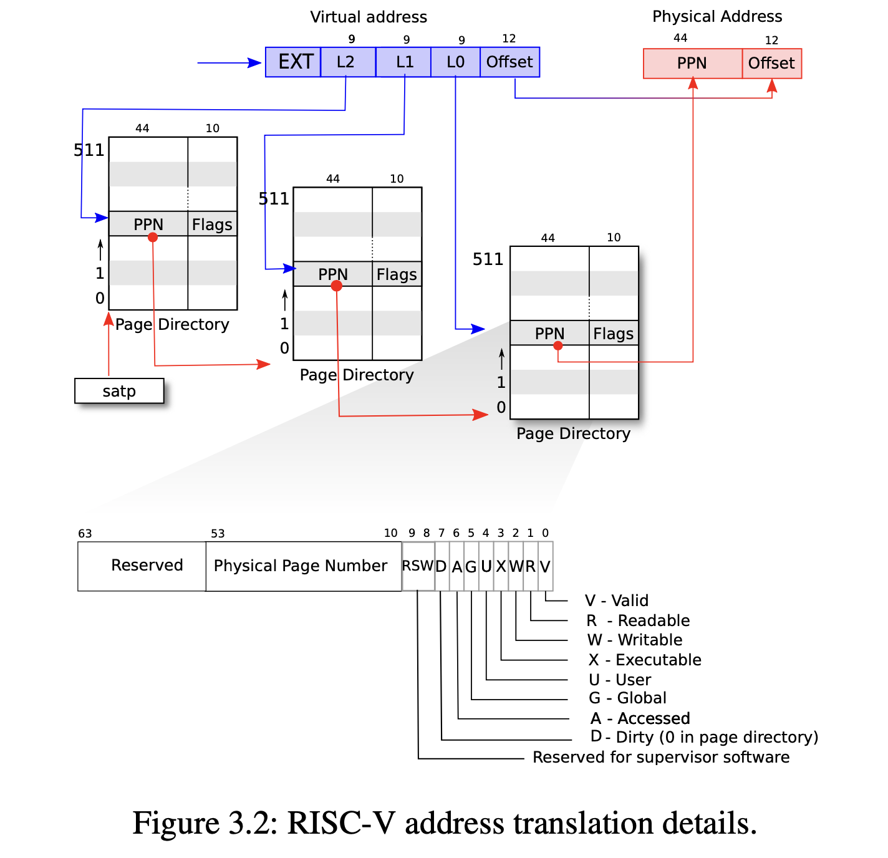

# Page Table

Isolate different process’s address spaces and to multiplex them onto a single physical memory.

## Paging hardware

**Sv39** RISC-V:

- Xv6 runs on **Sv39** RISC-V: only the bottom 39 bits of a 64-bit virtual address are used; the top 25 bits are not used. 

- a RISC-V **page table**: an array of $2^{27}$ *page table entries (PTEs)*

- a **PTE**: a 44-bit *physical page number (PPN)* and flags.

---

[Logically] The **paging hardware**: virtual address => physical address: 

  - handle a **39-bit virtual address**
    - top 27 bits of the 39 bits: index into the page table to find a PTE
    - bottom 12 bits: do not change
  - making a **56-bit physical address**: 
    - **top 44 bits** come from the PPN in the PTE
    - **bottom 12 bits** are copied from the original virtual address.

Virtual-to-physical address translations: aligned chunks of $2^{12}$ bytes. (Such a chunk is called a *page*.)

---

[Actually] Virtual -> Physical address **translation**:

- page table: three-level tree: pages of PTEs
- each PTEs page: 4096-bits: contains 512 PTEs to the next level
-  the top 27 bits virtual address to find PTE:
  - 9 bits => tree root
  - 9 bits => mid level
  - 9 bits => final PTE

---

In translation: any of the three required PTEs is **not present**:

- paging hardware raises a *page-fault exception*
- kernel handles the exception

---

**Flag bits of PTE**: how the associated virtual address is allowed to be used:

- `PTE_V`:  is the PTE present?
- `PTE_R`: allowed to read (to the page)?
- `PTE_W`: allowed to write?
- `PTE_X`: interpret the content of the page as instructions and execute
- `PTE_U`: allowed **user mode** instructions to access the page

(defined in [kernel/riscv.h:329-333](https://github.com/mit-pdos/xv6-riscv/blob/riscv//kernel/riscv.h#L329-L333))

---

Tell the hardware to **use a page table**:

- Kernel: write the physical address of the root page-table page into the `satp` register
- CPU: translate all addresses generated by subsequent instructions using the page table on its `satp`
- Each CPU has its own `satp`: different CPUs can run processes with a private address space described by its own page table.

---

Notes about terms:

- Physical memory refers to storage cells in DRAM
- A byte of physical memory has an address, called a physical address
- Instructions use only virtual addresses
- The paging hardware translates virtual addresses to physical addresses, and then sends them to the DRAM hardware to read or write storage
- virtual memory ≠ virtual addresses
  - virtual memory: the collection of abstractions and mechanisms the kernel provides to manage physical memory and virtual addresses.
  - virtual addresses & physical addresses: a physical object

## Kernel address space

- User address space: Xv6 maintains one page table per process.
- **Kernel address space**: an **additional single page table** to give the kernel itself access to :
  - physical memory
  - hardware resources at predictable virtual addresses

---

kernel address space layout: [kernel/memlayout.h](https://github.com/mit-pdos/xv6-riscv/blob/riscv//kernel/memlayout.h)

QEMU physical address space:

- below `0x80000000`: device interfaces to software as *memory-mapped* control registers:  
  - kernel interacts with the devices by reading/writing these special physical addresses.
- `0x80000000 ~ PHYSTOP`: RAM (physical memory) `PHYSTOP = at least 0x86400000`: 
  - kernel gets at RAM and memory-mapped device registers using “direct mapping” (`VA=X -> PA=X`)
  - the kernel itself is located at `KERNBASE=0x80000000` in both the virtual address space and in physical memory
- special kernel virtual addresses aren’t direct-mapped:
  1. The trampoline page: mapped at the top of the virtual address space (the same as user page tables)
    - NOTE: the page holding trampoline is mapped twice in the kernel virtual address space: once at top of the virtual address space and once with a direct mapping
  2. The kernel stack pages: Each process has its own kernel stack mapped below an unmapped *guard page* (whose PTE is invalid: PTE_V is not set). 
    - guard page:  if the kernel overflows a kernel stack into guard page => a kernel panic
    - without guard page:  overflowing stack overwrite other kernel memory => any incorrect operation

##  Creating an address space

>  [vm.c](https://github.com/mit-pdos/xv6-riscv/blob/riscv//kernel/vm.c#L1)

Central data structure:

- `pagetable_t`: a pointer to a RISC-V root page-table page

Functions:

- `kvmXXX`: manipulate the kernel page table
- `uvmXXX`: manipulate a user page table
- others: usedfor both

Key functions:

- `walk`: finds the PTE for a virtual addres
- `mappages`: installs PTEs for new mappings
- `copyin`: copy from user to kernel (system call arguments)
- `copyout`: copy from kernel to user

Boot: 

- main -> kvminit: create the kernel’s page table
- (kvminit -> kvmmap -> mappages -> walk)
- main -> kvminithart:  install the kernel page table
- main -> procinit (in kernel/proc.c): allocates a kernel stack for each pro- cess

---

Each RISC-V CPU caches page table entries in a *Translation Look-aside Buffer (TLB)*: 

- xv6 changes a page table => must tell the CPU to invalidate corresponding cached TLB entries.
  - `sfence.vma` instruction: flushes the current CPU’s TLB
  - in `kvminithart` after reloading the `satp` register
  - in the `trampoline` code that switches to a user page table before returning to user space  ([kernel/trampoline.S:79](https://github.com/mit-pdos/xv6-riscv/blob/riscv//kernel/trampoline.S#L79))

## Physical memory allocation

