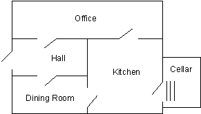

## Prolog 语法构成

其他的大多数变成语言，语法无非就是类型、声明、赋值、过程、条件、循环、调用等这些东西。但从我们前面的介绍可以看到，Prolog 的语法很不一样，并不是我们熟悉的这一套，所以有必要介绍一下其语法的构成。

**谓词**是 Prolog 语言的基本组成元素。谓词可以是一段程序、一个数据类型或者是一种关系。它由谓词名和参数组成。两个名称相同而参数的数目不同的谓词是不同的谓词。事实就是 Prolog 中最简单的谓词。

一个 Prolog 语句由一些 term 构成：

- atom
  - 常量：小写字母开头的单词：kaneishi
  - 字符串：`'Hello, world!'`
  - 一些特殊的符号：如 `:-`，`;`
- numbers
  - 整数：`123`，`0`，`-432`
  - 浮点数：`3.14`
- variable
  - 变量：大写字母或 `_` 开头的单词：`X`，`Who`，`_tag`
  - 匿名变量：`_` （一只孤单的下划线）
- structures（Complex terms）其实就是我们之前所定义的属性or关系：
  - `male(yomogi)`：其中 `male` 称为 functor（函子），`yomogi` 称为 argument（论证，参数）
  - `like(yomogi, yume)`
  - 还可以嵌套起来：`hide(X,father(father(father(butch))))`

Complex terms 中， 参数的个数叫做 **arity**。如 `male(yomogi)` 的 arity 为 1，`like(yomogi, yume)` 的 arity 为 2.

Prolog 允许名字相同但 arity 不同的 Complex terms，例如：

- `friend(yume, mei)`
- `friend(yomogi, kaneishi, ranka)`

为了区分二者，使用 `functor/arity` 来称呼他们：

- `friend/2`
- `friend/3`

二者会被区别对待，例如：

```c
% knowledge

friend(yume, mei).
friend(yomogi, kaneishi, ranka).

----

% query

?- friend(yume, mei).
true.
?- friend(yomogi, kaneishi, ranka).
true.
?- friend(yomogi, kaneishi).
false.
```


### 寻找 Nani

下面，我们编写一个 “寻找Nani” 的游戏。游戏发生在一个屋子🏠里，屋子的格局如下图所示：



在这个屋子中，有一些物体，我们也知道它们的位置，比如有一个苹果🍎在厨房（Kitchen）里。同时我们知道部分物品的一些属性，例如苹果苹果可以吃。

游戏的故事发生在一个伸手不见五指的晚上，玩家一开始时位于厨房，屋子里所有房间等都关着，（大晚上为什么会在厨房，灯也没开，，这个问题困扰我多年）

用 Prolog 中的一些列事实来表示这些房间，即：

```c
room(kitchen).
room(office).
room(hall).
room(‘dining room’).
room(cellar).
```

然后，再定义连通房间的门🚪：

```c
door(office, hall).
door(kitchen, office).
door(hall, ‘dining room’).
door(kitchen, cellar).
door(‘dining room’, kitchen).
```

在这个~~阴森的~~小屋子里有一些物品，我们用 `location(X, Y)` 表示有物品 X 位于房间 Y 中：

```c
location(desk, office).
location(apple, kitchen).
location(flashlight, desk).
location('washing machine', cellar). 
location(nani, 'washing machine').
location(broccoli, kitchen). 
location(crackers, kitchen).
location(computer, office).
```

然后，我们还知道一些物品的属性：

```prolog
edible(apple). 
edible(crackers). 
tastes_yucky(broccoli). 
```

在游戏开始时，我们的玩家位于厨房：

```prolog
here(kitchen).
```

故事发生在晚上，玩家必须先找到手电筒，并打开它，然后才能到那些关了灯的房间：

```prolog
turned_off(flashlight).
```

