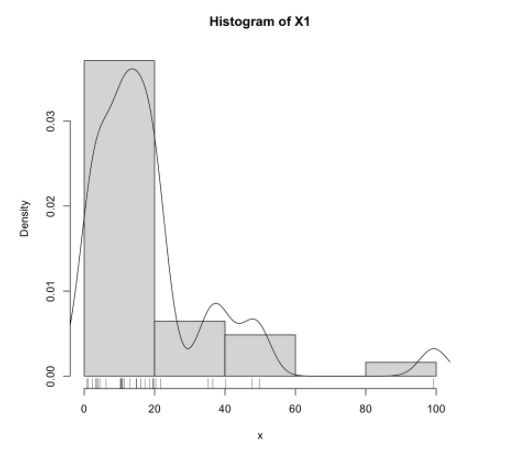

# 用 R 做数据分析

> Vol_1：数据的数字特征及相关分析

## 导入数据

### 导入文本表格数据

```sh
Year  Nationwide  Rural  Urban
1978  184         138    405
1979  207         158    434
1980  236         178    496
1981  262         199    562
1982  284         221    576
1983  311         246    603
1984  354         283    662
1985  437         347    802
...
```

R 代码：

```R
data <- read.table("./data.txt", header=TRUE)
data
```

结果：


### 导入 CSV 数据

```sh
 序号,省市区,11月,1～11月
 1,北京,35.22,499.8
 2,天津,10.41,161.37
 3,河北,17.22,273.29
 4,山西,10.7,134.79
 5,内蒙古,10.29,90.92
 ...
```

R 代码：

```R
data <- read.csv("./data.csv")
```

注：这个数据里表头标题有中文、有特殊符号，会被 R 自动处理成：

```R
> cat(names(data))
X.序号 省市区 X11月 X1.11月
```

可以手动改一下：

```R
data <- data[-1]  # remove "序号" col
names(data) <- c("Province", "X1", "X2")
data
```

结果：


注：后文里会随机使用这两个导入的数据中的一个作示例。

### attach

为了方便调用 data.frame 里的各列数据，我们可以：

```R
attach(data)
```

然后就可以直接用列名引用一列数据了，比如：

```R
print(X1)
```

不必再通过 data 取索引：

```R
print(data[2])
```

用完之后，记得 detach：

```R
detach(data)
```


## 均值、方差、标准差、变异系数、偏度、峰度

### 单变量

数据：一个变量，一“列”数据

```R
x <- c(1, 2, 3, 4, 5)
```

均值：

$$
\overline x = \frac{1}{n}\sum_{i=1}^nx_i
$$

```R
mean(x)
```

方差：
$$
s^2=\frac{1}{n-1}\sum_{i=1}^n(x_i-\overline x)^2
$$

```R
var(x)
```
标准差：
$$
s = \sqrt{s^2}=\sqrt{\frac{1}{n-1}\sum_{i=1}^n(x_i-\overline x)^2}
$$


```R
sd(x)
```

变异系数：
$$
CV = \frac{s}{\overline x}
$$

```R
cv <- function(x) sd(x)/mean(x)

cv(x)
```

注：书上是百分数的 $CV = 100 \times \frac{s}{\overline x} (\%)$.

偏度：
$$
g_1=\frac{1}{(n-1)(n-2)}\frac{1}{s^3}\sum_{i=1}^n(x_i-\overline x)^3
$$

```R
g1 <- function(x) {
    n <- length(x)
    A <- n / ((n-1) * (n-2))
    B <- 1 / sd(x)^3
    S <- sum((x - mean(x))^3)
    A * B * S
}

g1(x)
```

峰度：
$$
g_2 = \frac{n(n+1)}{(n-1)(n-2)(n-3)}\frac{1}{s^4}\sum_{i=1}^n(x_i-\overline x)^4\\-\frac{3(n-1)^2}{(n-2)(n-3)}
$$


```R
g2 <- function(x) {  # 峰度
    n <- length(x)
    A <- (n * (n+1)) / ((n-1) * (n-2) * (n-3))
    B <- 1 / sd(x)^4
    S <- sum((x - mean(x))^4)
    C <- (3 * (n-1)^2) / ((n-2) * (n-3))
    A * B * S - C
}

g2(x)
```

### 作用于 data.frame

我们导入的数据都是 data.frame，可以单独取出一列来，就和上面的 `x` 一样了：

```R
x <- data[[2]]  # 取出 data 的第二列数据

mean(x)
```

但每一列都都调用一次也很烦，所以这里还有一种方法，一次性把 mean 或者其他函数作用于 data.frame 的各列（这里用前文第一个表格导入进来的 data 做例子）：

```R
apply(data[-1], MARGIN=2, FUN=mean)
```

结果：


说明：

- 这里 data 的第一列是字符的，求均值没有意义: 用 `data[-N]` 去掉第 N 列（R 从 `1` 开始索引）
- 第二个参数 `MARGIN=2` 就是逐列处理
- 第三个 FUN 是要作用的函数，这里是求均值。方差什么的也是一样的，把这个参数换成 `FUN=var` 啥的就行了。

#### all in one

为了方便，我们可以把算这几个东西的过程封装在一起：

```R
describes <- function(df) {
    # TODO: 优化重复计算
    cv <- function(x) sd(x)/mean(x)  # 变异系数

    g1 <- function(x) {  # 偏度
        n <- length(x)
        A <- n / ((n-1) * (n-2))
        B <- 1 / sd(x)^3
        S <- sum((x - mean(x))^3)
        A * B * S
    }

    g2 <- function(x) {  # 峰度
        n <- length(x)
        A <- (n * (n+1)) / ((n-1) * (n-2) * (n-3))
        B <- 1 / sd(x)^4
        S <- sum((x - mean(x))^4)
        C <- (3 * (n-1)^2) / ((n-2) * (n-3))
        A * B * S - C
    }
    
    itm <- matrix(c("均值", "方差", "标准差", "变异系数", "偏度", "峰度"), 6, 1)
    res <- apply(df, 2, 
                 function(x) c(mean(x), var(x), sd(x), cv(x), g1(x), g2(x)))
    
    cbind(itm, res)
}
```

传入参数是一个 data.frame，这个函数会求出各列的均值、方差等，（例如作用于前文导入的 csv 数据）：

```R
describes(data[-1])
```

结果：


一次性全出来了，这样就很方便。

### 调包

当然，这些操作都有第三方包有封装实现，比如这个：

- [psych](https://cran.r-project.org/web/packages/psych/index.html)

安装这个包（直接在 R 里面写）：

```R
install.packages("psych")
```

导包：

```R
library(psych)
```

然后就可以用这个包里的东西了。

这个包提供了前面最难写的峰度偏度：

```R
# g1、g2 是用 type=2: see help(skew)
g1 <- function(x) skew(x, type=2)
g2 <- function(x) kurtosi(x, type=2)  # help(kurtosi)
```

这个包还提供了一个 `describe` 函数可以一次性求出前面大多数值（类似于我们手写的 `describes`）：

```R
describe(data[-1], type=2)
```

结果：


## 中位数、上下四分位数、四分位极差

可以先求**五数**：最小值、下四分位数、中位数、上四分位数、最大值

```R
fn <- apply(data[-1], 2, fivenum)
fn
```


四分位极差：

```R
R1 <- function(Q3, Q1) Q3 - Q1

R1(Q3=fn[4,], Q1=fn[2,])
```

> [Math Time]
>
> p 分位数：
>
> $$
> M_p=\left\{\begin{array}
> 	x_{([np]+1)} ,&  np \textrm{ 不是整数}\\
> 	\frac{1}{2}(x_{(np)}+x_{(np+1)}) ,&  np \textrm{ 是整数}\\
> \end{array}\right.
> $$
> 上下四分位数：
> $$
> Q_3=M_{0.75}, \qquad Q_1=M_{0.25}
> $$
> 四分位极差：
> $$
> R_1=Q_3-Q_1
> $$

注：R 求分位数用 `quantile`，详见 `help(quantile)`。

有了上下四分位数、四分位极差，可以求个异常数据：

定义：下、上截断点：

$$
Q_1-1.5R_1,\qquad Q_3+1.5R_1
$$

大于「上截断」、小于「下阶段」的数据视为*异常值*：

```R
abnormal <- function(x) {
    fn <- fivenum(x);
    Q1 <- fn[2];  Q3 <- fn[4];
    
    R1 <- Q3 - Q1
    
    QD <- Q1 - 1.5 * R1
    QU <- Q3 + 1.5 * R1
    
    x[(x < QD) | (x > QU)]
}
```

```R
apply(data[-1], 2, abnormal)
# 若结果为空则没有异常值
```

## 数据分布图

### 茎叶图

```R
stem(Nationwide)
```


### 直方图

最简单的是直接用 `hist(x)`，但我们可以画的好看一点。

封装：

```R
histogram <- function(x, xname="x") {
    hist(x, prob=TRUE, main=paste("Histogram of" , xname))
    lines(density(x))
    rug(x) # show the actual data points
}
```

调用：

```R
histogram(X1, "X1")
```

结果：



### 经验分布函数图

封装：

```r
plot_ecdf <- function(x, xname="x") {
    plot(ecdf(x), do.points=FALSE, verticals=TRUE, main=paste("ecdf(" , xname, ")"))
    
    xs <- seq(min(x), max(x), 1/sqrt(length(x)))
    lines(xs, pnorm(xs, mean=mean(x), sd=sd(x)), lty=3, col="red")
}
```

注意 `xs` 这里我选择用 $\frac{1}{\sqrt{n}}$ 的密度，这个值比较适合我的数据（画出来不过稀也不太密），这个可以随便改。

调用：

```R
plot_ecdf(X1, "X1")
```

结果：


### 正态 Q-Q 图

```R
qqnorm(X1)
```


## Pearson 与 Spearman 相关系数

### Pearson 相关系数

二维总体： $(X,Y)^T$

观测数据：$(x_1,y_1)^T,(x_2,y_2)^T,\cdots,(x_n,y_n)^T$

记：$\overline x=\frac{1}{n}\sum_{i=1}^nx_i,\quad \overline y=\frac{1}{n}\sum_{i=1}^ny_i$

则 $X, Y$ 的观测数据的方差：
$$
s_{xx}=\frac{1}{n-1}\sum_{i=1}^n(x_i-\overline x)^2
\quad
s_{yy}=\frac{1}{n-1}\sum_{i=1}^n(y_i-\overline y)^2
$$
$X,Y$ 的观测数据的协方差：
$$
s_{xy}=\frac{1}{n-1}\sum_{i=1}^n(x_i-\overline x)^2(y_i-\overline y)^2
$$
（注：协方差矩阵 $S=\left[\begin{matrix}s_{xx} & s_{xy} \\ s_{yx} & s_{yy}\end{matrix}\right]$，其中 $s_{yx}=s_{xy}$）

Pearson 相关系数：
$$
r_{xy}=\frac{s_{xy}}{\sqrt{s_{xx}}\sqrt{s_{yy}}}
$$

这个值 $|r_{xy}|\le1$，衡量 X 和 Y 的线性相关程度:

- $r_{xy}\rightarrow 1$ 正相关
- $r_{xy}\rightarrow 0$ 不线性相关
- $r_{xy}\rightarrow -1$ 负相关

用 R 来算相关系数，用 `cor(x, y, method="pearson")` 这个函数会直接求出 $r_{xy}$ 值。也可以用下面这个函数，会输出更多的信息：

```R
cor.test(X1, X2, method="pearson")
```

输出：($\textrm{cor}=r_{xy}$)


【Math Time】关于上面输出的假设检验：

设二维总体  $(X,Y)^T$ 的分布函数为 $F(x,y)$

总体的相关系数 $\rho_{_{XY}}=\frac{\mathrm{Cov}(X,Y)}{\sqrt{\mathrm{Var}(X)}\sqrt{\mathrm{Var}(Y)}}$

$n$ 充分大时，有 $\rho_{_{XY}} \approx r_{xy}$

现在的问题是：

- 对任意观测数据总可以求到 $r_{xy}$，而且求出来一般不为0
- 而如果总体的 $X$、$Y$ 是不相关的（$\rho_{XY}=0$）：这时用 $r_{xy}$ 来度量 $X$、$Y$ 的关联性就没有意义了。

所以要做个假设检验：
$$
H_0:\rho_{_{XY}}=0 \quad \leftrightarrow \quad H_1:\rho_{_{XY}}\ne0
$$
若总体时二维正态的，则 $H_0$ 为真时，统计量 
$$
t=\frac{T_{xy}\sqrt{n-2}}{\sqrt{1-r_{xy}^2}}
\sim
t(n-2)
$$
将观测数据算得的 $t$ 值记为 $t_0$ 则检验 $p$ 值：
$$
p=P_{H_0}(|t|>|t_0|)=P(|t(n-2)|\ge|t_0|)
$$
给定显著水平 $\alpha$ ，$p<\alpha$ 时拒绝 $H_0$，认为 $X,Y$ 相关，可以用 $r_{xy}$ 衡量相关程度。 

### Spearman 相关系数

Spearman 是**秩相关系数**。

样本秩：把观测值 $x_1,x_2,\cdots,x_n$ 从小到大排序，$x_i$ 排在第几个则其秩 $R_i$ 就是多少。

e.g.
$$
\begin{array}{r}
x_i: & 7 & -3 & -1 & 5 \\
R_i: & 4 & 1 & 2 & 3
\end{array}
$$

记：

- $x_1,x_2,\cdots,x_n$ 的秩分别为：$R_1,R_2,\cdots,R_n$
- $\overline R=\frac{1}{n}\sum_{i=1}^nR_i=\frac{1}{n}\sum_{i=1}^n i=\frac{n+1}{2}$
- $y_1,y_2,\cdots,y_n$ 的秩分别为：$S_1,S_2,\cdots,S_n$
- $\overline S=\frac{1}{n}\sum_{i=1}^nS_i=\frac{n+1}{2}$

则定义 Spearman 相关系数：
$$
\begin{array}{l}
q_{xy} &=& \frac{\sum_{i=1}^n(R_i-\overline R)(S_i-\overline S)}{\sqrt{\sum_{i=1}^n(R_i-\overline R)^2}\sqrt{\sum_{i=1}^n(S_i-\overline S)^2}}
\\
&=& 1-\frac{6}{n(n^2-1)}\sum_{i=1}^n(R_i-S_i)
\end{array}
$$
用 R 来计算(输出里 $\textrm{rho}=q_{xy}$)：

```R
cor.test(X1, X2, method="spearman")
```


还是一样的，有一个假设检验：
$$
H_0:\rho_{_{XY}}=0 
\quad \leftrightarrow \quad
H_1:\rho_{_{XY}}\ne0
$$
