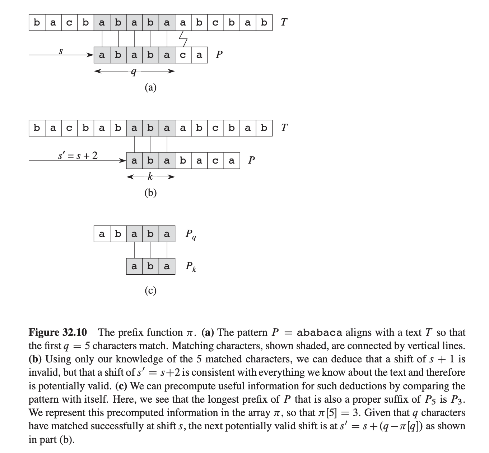
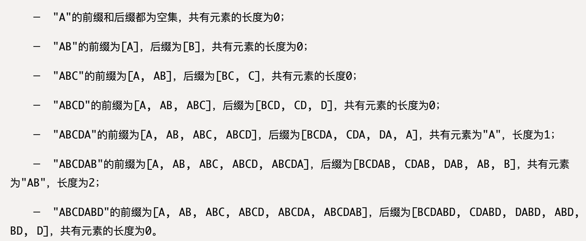

# KMP

暴力算法是在失配时，回溯子串指针，从头开始匹配。而 KMP 失配时尝试更有进取心地往前走，掠过那些不可能匹配的情况。往前移动的长度由一个「部分匹配表」来确定。



（图片来自 CLRS《Introduction to Algorithms, 3rd Ed》[^1]）

部分匹配表其实就是失配那个位置前面（匹配上的）里面最长的公共前后缀长度，移动就是要把前缀直接对上后缀那个位置，就略过了中间不可能匹配（已经扫过了，后面不匹配，再重复扫也还是不匹配）的那一段，直接开始尝试下一个可能的匹配。

## 部分匹配表

参考 Wikipedia 的算法 [^2]（看英文页，中文页没写全，有些段落缺失）。

**手算**：

```go
func GetNext(substr: string) []int {  // substr: [0…M-1]
    M := len(substr)
    next := make([]int, M)

    next[0] = -1
    for j := 1; j <= M; j++ {
        next[j] = len(
            最长公共前后缀(substr[0:j])  // 就是 j 那个字符之前的
        )
    }

    return next
}
```

其中「最长公共前后缀」就是例如：



（图片来自 阮一峰《字符串匹配的KMP算法》[^3]）

**编程**快速计算：

```go
func GetNext(substr string) []int {
	next := make([]int, len(substr))
	next[0] = -1

	i, j := 0, -1
	for i < len(substr)-1 {
		if j == -1 || substr[i] == substr[j] {
			i++
			j++
			next[i] = j
		} else {
			j = next[j]
		}
	}
	return next
}
```

## 匹配

KMP：

```go
func KMP(s string, substr string) int {
	next := GetNext(substr)

	i, j := 0, 0
	for i < len(s) && j < len(substr) {
		if j == -1 || s[i] == substr[j] {
			i++
			j++
		} else { // miss matching
			j = next[j]
		}
	}

	if j >= len(substr) { // matched
		return i - len(substr)
	}
	return -1 // not matched
}
```

这个程序是真的可以运行的：

```go
package main

// ...

func main() {
	s := "BBC ABCDAB ABCDABCDABDE"
	sub := "ABCDABD"

	res := KMP(s, sub)
	println(res)
}
```

## next 数组

补充一点：部分匹配表，还有几种不同的版本，比如《算法导论》[^1]  上的，再比如我们的考研书（天勤王道）[^4]$^,$[^5]上的。

（考研书上把部分匹配表亲切地称为 “**next 数组**”。。。）

这几种的区别看下面这个例子：

| index     | 0    | 1    | 2    | 3    | 4    | 5    | 6    |                             |
| --------- | ---- | ---- | ---- | ---- | ---- | ---- | ---- | --------------------------- |
| char      | a    | b    | a    | b    | a    | c    | a    |                             |
| CLRS      | 0    | 0    | 1    | 2    | 3    | 0    | 1    |                             |
| Wikipedia | -1   | 0    | 0    | 1    | 2    | 3    | 0    | = CLRS 右移一个，左边补`-1` |
| 天勤王道  | 0    | 1    | 1    | 2    | 3    | 4    | 1    | = Wikipedia + 1             |

若在原串（大的）索引 `i` 处、模式（子串）索引 `j` 处失配：

- CLRS 移动到 `T[j-1]` 上（特殊情况：`j=0` 则 `i+=1`）
- Wikipedia 移到 `T[j]` 上（特殊情况：`j=-1` 则 `j+=1`）。

## 更好理解的代码

说实话，我看不懂上面给的代码。主要是这段 `if (j==-1 || s[i] == substr[j]) {...}` WTF？？

研究了好久才看懂明明就是两种不同的情况，只是凑巧处理方式一样就合并在一起，，搁这儿写汇编呢。。吐了。

参考 [知乎上的回答](https://www.zhihu.com/question/21923021/answer/1032665486) [^6] 把这两种情况分开写就容易理解多了：

```go
func GetNext(substr string) []int {
	next := make([]int, len(substr))
	next[0] = -1

	i, j := 0, -1
	for i < len(substr)-1 {
        if j == -1 { // 特殊: 到头了: 最小了，无可再缩
			i++
			j = 0
			next[i] = j
		} else if substr[i] == substr[j] { // 配上了：扩大一位
			i++
			j++
			next[i] = j
		} else { // 失配：缩小，重新匹配
			j = next[j]
		}
	}
	return next
}

func KMP(s string, substr string) int {
	next := GetNext(substr)

	i, j := 0, 0 // i 是 s 的，j 是 substr 的
	for i < len(s) && j < len(substr) {
        if j == -1 { // 特殊: 回到头了: i 移一个，j 从头比较
			i++
			j = 0
		} else if s[i] == substr[j] { // 配上了: 下一个字符
			i++
			j++
		} else { // 失配: j 移到下一个可能匹配的位置
			j = next[j]
		}
	}

	if j >= len(substr) { // matched
		return i - len(substr)
	}
	return -1 // not matched
}
```

# 改进 KMP

考研书上的，用个 `nextval` 替代 `next` 数组。

`nextval` 构造规则如下：

```c
nextval[0] = -1;
for (int j = 1; j < len(substr); j++) {
    nextval[j] = (substr[j] != substr[next[j]] ? 
        next[j] :
        nextval[next[j]]
    );
}
```

就是构建部分匹配表，回溯（缩小）的时候，如果回到的上一步 `next[j]` 的字符和当前字符相同，就不必一步步回溯了（之前已经走过了），直接借用之前的结果，快速回溯到头。

e.g.

| substr  | A    | B    | A    | B    | A    | A    | B    |
| ------- | ---- | ---- | ---- | ---- | ---- | ---- | ---- |
| j       | 0    | 1    | 2    | 3    | 4    | 5    | 6    |
| next    | -1   | 0    | 0    | 1    | 2    | 3    | 1    |
| nextval | -1   | 0    | -1   | 0    | -1   | 3    | 0    |

（记得考验书上索引从 1 开始，next、nextval 的值都要加一）

# 推荐阅读

还有下面参考文献的阮一峰，通俗易懂，看这篇手算就够了。Wikipedia 的也还行（一定要看英文页）。

有时间再啃 CLRS。

死背代码的话，天勤王道。

还有 [https://leetcode-cn.com/problems/implement-strstr/solution/kmp-suan-fa-xiang-jie-by-labuladong/](https://leetcode-cn.com/problems/implement-strstr/solution/kmp-suan-fa-xiang-jie-by-labuladong/) 这篇写的也屌（这个大佬的公众号我关注了数年了），用动规（其实是 DFA）解释了 KMP，推荐阅读。

# 参考文献

[^1]: Cormen T H , Leiserson C E , Rivest R L , et al. Introduction to Algorithms, 3rd Ed.

[^2]: Wikipedia. Knuth–Morris–Pratt algorithm. [https://en.wikipedia.org/wiki/Knuth–Morris–Pratt_algorithm](https://en.wikipedia.org/wiki/Knuth–Morris–Pratt_algorithm)

[^3]: 阮一峰. 字符串匹配的KMP算法. [http://www.ruanyifeng.com/blog/2013/05/Knuth–Morris–Pratt_algorithm.html](http://www.ruanyifeng.com/blog/2013/05/Knuth–Morris–Pratt_algorithm.html) 

[^4]: 率辉主编. 数据结构高分笔记（2022版 天勤第10版）.  机械工业出版社, 2020.
[^5]: 王道论坛组编. 2022年数据结构考验复习指导. 电子工业出版社, 2021
[^6]: 阮行止. 如何更好地理解和掌握 KMP 算法?. https://www.zhihu.com/question/21923021/answer/1032665486

