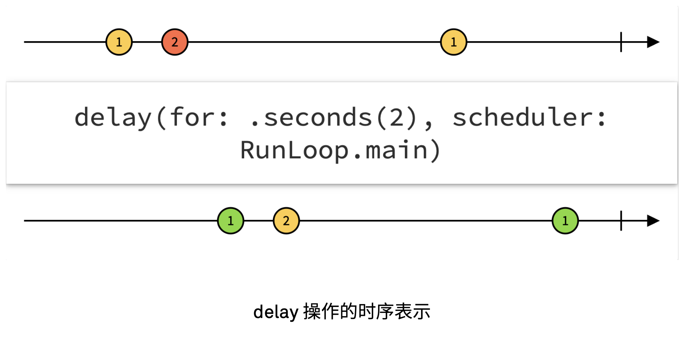

# 异步编程与 Combine

## 异步编程


## Combine

**[Combine](https://developer.apple.com/documentation/combine)**: Customize handling of asynchronous events by combining event-processing operators.


### Publisher

Publisher 负责发布事件。

```swift
public protocol Publisher {
    /// 要发布的值类型
    associatedtype Output

    /// 可能发布的错误类型
    associatedtype Failure : Error

    /// 连接订阅者，连上后 subscriber 就可以从 Publisher 接收了
    func receive<S>(subscriber: S) where 
        S : Subscriber, 
        Self.Failure == S.Failure, 
        Self.Output == S.Input
}
```

Publisher 可以发布三种事件:

- output：事件流中发布新的值，类型为 Output；
- failure：发生错误，事件流终止，类型为 Failure； (`.failure(e)`).
- finished：事件流结束； (`.finished`)

### Operator

#### scan


 Publisher 的 `scan` 方法提供一个暂存值，每次事件发生时执行一个闭包来更新这个暂存值，并准备好在下一次事件时使用它。这个暂存值也将被作为新的 Publisher 事件被发送出去。

```swift
public func scan<T>(
    _ initialResult: T, 
    _ nextPartialResult: (T, Self.Output) -> T) 
-> Publishers.Scan<Self, T>
```

e.g.

```swift
let foo: AnyPublisher<Void, Never>
let fooCounter = foo.scan(0) { value, _ in value + 1 }
```

- `foo` 发出 E, E, E, ...
- `fooCounter` 发出 1, 2, 3, ...

#### map

```swift
public func map<T>(
    _ transform: (Self.Output) -> T) 
-> Publishers.Map<Self, T>
```

map 也是返回一个新的 Publisher，通过一个闭包来转化原来的 Publisher 的结果。

```swift
let fooCounterStr = foo
    .scan(0) { value, _ in value + 1 }
    .map{ String($0) }
```

- `foo` 发出 E, E, E, ...
- `fooCounterStr` 发出 "1", "2", "3", ...

类似的还有很多啦，大抵都是用这种函数式的形式，来对原有的 Publisher 进行变形等逻辑操作。这些操作就扮演了 Operator 的角色。

每个 Operator 都使用上游 Publisher 所发布的数据作为输入， 以此产生的新的数据，然后自身成为新的 Publisher，并将新的数据作为输出， 发布给下游。

通过一系列组合（Combine），就得到了一个 Publisher 的链条。首部是发生的事件，中间对事件进行变形处理，末尾就得到了可以直接供给 Subscriber 消费。

### Subscriber

```swift
public protocol Subscriber {
    /// 要接收的值的类型
    associatedtype Input

    /// 可能接收的错误类型
    associatedtype Failure : Error

    /// 告诉 subscriber 成功订阅了 publisher，可以接收了
    func receive(subscription: Subscription)
    func receive(_ input: Self.Input) -> Subscribers.Demand
    func receive(completion: Subscribers.Completion<Self.Failure>)
}
```

Combine 里面也已经提供了一些常用的 Subscriber 了，例如 `Sink` 和 `Assign`。

#### Sink

Sink 是个通过闭包去处理接收到的值的 Subscriber。

调用 `sink` 方法，可以把 Sink Subscriber 加到 Publisher 的链条末端：

```swift
public func sink(
    receiveCompletion: ((Subscribers.Completion<Self.Failure>) -> Void), 
    receiveValue: ((Self.Output) -> Void)) 
-> AnyCancellable
```

通过给 sink 的闭包，就对拿到的事件可以执行任意操作。可以用 Sink 结束响应函数式的 Publisher 链，最终桥接到基于闭包的指令式代码。

e.g.

```swift
let foo = (0 ... 5).publisher.map { _ in }

foo
    .scan(0) { value, _ in value + 1 }
    .map { String($0) }
    .sink { print("foo count: \($0)") }
```

#### Assign

Assign，如其名，就是个专注于赋值的 Subscriber。`assign` 接受一个某 class 的实例以及对象类型上的某个键路径 (`\.name`)。当 output 事件到来时，其中包含的值就将被设置到对应的属性上去:

```swift
import Combine

class Bar {
    var count: String = ""
}

let bar = Bar()

let foo = (0 ... 5).publisher.map { _ in }

foo
    .scan(0) { value, _ in value + 1 }
    .map { String($0) }
    .assign(to: \.count, on: bar)

print(bar.count)  # output: 6
```

## 其他角色

### Subject

```swift
public protocol Subject : AnyObject, Publisher {
    /// Sends a value to the subscriber.
    func send(_ value: Self.Output)

    /// Sends a completion signal (`.failure(e)` or `.finished`)
    func send(completion: Subscribers.Completion<Self.Failure>)
}
```

`Subject` 是用来给外部调用者通过 send 方法来发布 output 值、failure 或 finished 事件的。

和 Sink 刚好相反，Subject 可以完成“指令式 -> 响应式”。

#### PassthroughSubject

`PassthroughSubject` 是 Combine 中的一种 Subject 具体实现。PassthroughSubject 将 send 接收到的事件转发给下游。接收到才转发，没接收到就闲着。

```swift
let mySubject = PassthroughSubject<Int, Never>()

mySubject.send(123)  // 没人监听，丢失了

mySubject.sink(
    receiveCompletion: { print("complete: \($0)") },
    receiveValue: { print("value: \($0)")}
)  // 开始监听

mySubject.send(666)
mySubject.send(completion: .finished)
```

运行输出：

```
value: 666
complete: finished
```

#### CurrentValueSubject

`CurrentValueSubject` 相当于是个带了缓冲的 PassthroughSubject。在订阅发生的瞬间，CurrentValueSubject 会把当前保存的值发送给订阅者，之后的行为就和 PassthroughSubject 相同了。

也就是说，它可以缓冲一个值：

```swift
let anotherSubject = CurrentValueSubject<Int, Never>(1024)

// anotherSubject.send(2048)
// anotherSubject.send(4096)

print("开始监听")
anotherSubject.sink(
    receiveCompletion: { print("complete: \($0)") },
    receiveValue: { print("value: \($0)")}
)

anotherSubject.send(8192)
anotherSubject.send(16384)
anotherSubject.send(completion: .finished)
```

输出：

```
开始监听
value: 1024
value: 8192
value: 16384
complete: finished
```

把上面的两行注释取消：

```swift
let ...

anotherSubject.send(2048)
anotherSubject.send(4096)

print("开始监听")
...
```

则输出：

```swift
开始监听
value: 4096
value: 8192
value: 16384
complete: finished
```

### Scheduler

- `Publisher`：决定发布什么事件流 (what)；
- `Scheduler`：决定在什么地方 (where)、什么时候 (when) 发布事件和执行代码；

#### where

在网络请求之后，响应是在后台线程的，用用请求的结果更新 UI，就需要转到主线程：

```swift
URLSession.shared
    .dataTaskPublisher(for: URL(string: "https://example.com")!)
    .compactMap { String(data: $0.data, encoding: .utf8) }
    .receive(on: RunLoop.main)  // Scheduler here
    .sink(
        receiveCompletion: { _ in }, 
        receiveValue: { textView.text = $0 }
     )
```

`RunLoop` 就是实现了 Scheduler 协议的类型。`receive(on: RunLoop.main) ` 把接收从后台线程转到主线程，以更新 UI。

####  when

默认情况下，Publisher 会尽量及时把事件传递给下游。但可以用 Scheduler 加入延迟。

- `delay`：将事件逐一延后一定时间



- `debounce`：延迟所有事件，直到在一定时间里没有新的事件到来，才发生最后一次事件的值。


## 参考

[1] 王巍《SwiftUI与Combine编程》ch5

