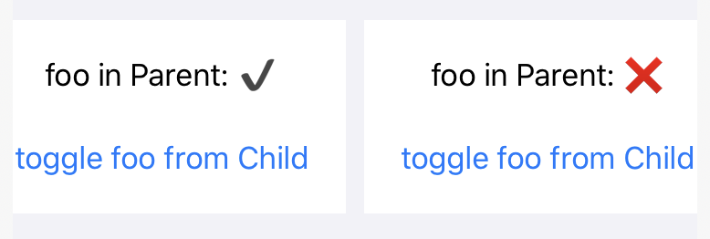

# SwiftUI 数据状态和绑定

| 方案                                   | 说明                                   | 备注                                                |
| -------------------------------------- | -------------------------------------- | --------------------------------------------------- |
| `@State` & `@Binding`                  | 提供 View 内部的状态存储               | 应该是被标记为 private 的简单值类型，仅在内部使用。 |
| `ObservableObject` & `@ObservedObject` | 针对跨越 View 层级的状态共享           | 处理更复杂的数据类型，在数据变化时触发界面刷新。    |
| `@EnvironmentObject`                   | 对于 “跳跃式” 跨越多个 View 层级的状态 | 更方便地使用 ObservableObject，以简化代码。         |

## `@State` & `@Binding`

Parent view:

```swift
struct ParentView: View {
    @State private var foo: Bool = false

    var body: some View {
        VStack(spacing: 25) {
            Text("foo in Parent: \(self.foo ? "✔️" : "❌")")
            ChildView(foo: $foo)
        }
    }
}
```

Child view:

```swift
struct ChildView: View {
    @Binding var foo: Bool

    var body: some View {
        Button("toggle foo from Child") {
            self.foo.toggle()
        }
    }
}
```

运行效果：



##`@ObservedObject` 

Model:

```swift
class Model: ObservableObject {
    @Published var foo: Bool = false
}
```

注意，`@Published` 是个 internal 的。在 Xcode 工程里没事，但在 Playground 的 Sources 里写是必须 public 的，这时可以采用下面这种手动处理的方法：

```swift
import Combine

public class Model: ObservableObject {
    public let objectWillChange = PassthroughSubject<Void, Never>()

    public var foo: Bool = false {
        willSet { objectWillChange.send() }
    }

    public init() {}
}
```

- `let objectWillChange = PassthroughSubject<Void, Never>()` 用来实现 `ObservableObject` 协议；
- 给每个需要 `@Published` 的变量加 `willSet { objectWillChange.send() }` 。

Parent View:

```swift
public struct ParentView: View {
   @ObservedObject var model: Model = Model()

   public var body: some View {
       VStack(spacing: 25) {
           Text("foo in Parent: \(self.model.foo ? "✔️" : "❌")")
           ChildView(model: model)
       }
   }
    
    public init() {}
}
```

Child View:

```swift
public struct ChildView: View {
   var model: Model

   public var body: some View {
       Button("toggle foo from Child") {
           self.model.foo.toggle()
       }
   }
    
    public init(model: Model) {
        self.model = model
    }
}
```

这里其实是利用 class 的“传引用”特性来让子访问到父的 model 的，没什么特殊的。

##`@EnvironmentObject` 

沿用上面 `ObservableObject` 的 Model:

```swift
class Model: ObservableObject {
    @Published var foo: Bool = false
}
```

Parent View:

```swift
public struct ParentView: View {
   @EnvironmentObject var model: Model

   public var body: some View {
       VStack(spacing: 25) {
           Text("foo in Parent: \(self.model.foo ? "✔️" : "❌")")
           ChildView()
       }
   }
    
    public init() {}
}
```

Child View:

```swift
public struct ChildView: View {
   @EnvironmentObject var model: Model

   public var body: some View {
       Button("toggle foo from Child") {
           self.model.foo.toggle()
       }
   }
    
    public init() {}
}

```

调用 Parent 的 View：

```swift
ParentView().environmentObject(Model())
```

用 EnvironmentObject 让所有子都访问到父的 Model，可以避免逐层手动传递对象。

完整源码实现：[SwiftUIDataStateAndBinding.playground](https://github.com/cdfmlr/clownote/tree/master/source/_posts/SwiftUI/SwiftUIDataStateAndBinding/SwiftUIDataStateAndBinding.playground)。

## 参考

王巍 (@onevcat)《SwiftUI 与 Combine 编程》Chapter 3：数据状态和绑定

