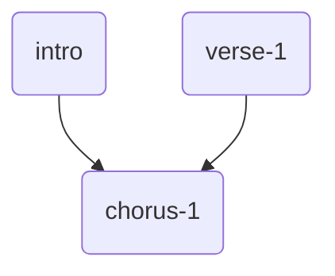

# Go 1.18

来学习一下 Go 1.18 的一些新特性。

## 泛型

> Generics: 参数化类型

### 从前

以前是这样的：

```go
package main

import "fmt"

func main() {
    ints := map[string]int64{
        "first": 34,
        "second": 12,
    }

    floats := map[string]float64{
        "first": 35.98,
        "second": 26.99,
    }

    fmt.Printf("Non-Generic Sums: %v and %v\n",
        SumInts(ints),
        SumFloats(floats))
}

func SumInts(m map[string]int64) int64 {
    var s int64
    for _, v := range m {
        s += v
    }
    return s
}

func SumFloats(m map[string]float64) float64 {
    var s float64
    for _, v := range m {
        s += v
    }
    return s
}
```

`SumInts` 和 `SumFloats` 几乎一模一样，只是 s 的类型不同，但需要分别处理。

### 类型参数

现在：`Go1.18` 泛型，支持**类型参数**，与普通参数类似，不过在定义时指定的不是类型而是泛型约束，而调用是传人的不是值而是实际类型。

定义函数时，可以在方括号里加入类型参数：

```go
func SumIntsOrFloats[K comparable, V int64 | float64](m map[K]V) V {
    var s V
    for _, v := range m {
        s += v
    }
    return s
}
```

指定类型 `K` 为 `comparable`，这种类型可以进行等于、不等于的比较运算，map 的键要求这种类型。而类型 `V` 是 `int64` 或 `float64`。

调用这个泛型函数时，在方括号里传入类型参数的实际类型——即某种确定的类型：

```go
fmt.Printf("Generic Sums: %v and %v\n",
    SumIntsOrFloats[string, int64](ints),
    SumIntsOrFloats[string, float64](floats))
```

### 类型参数推断

很多情况下（但不是任何时候），Go 可以自动推断出泛型的实际类型，这时可以省略方括号传入实际类型：

```go
fmt.Printf("Generic Sums, type parameters inferred: %v and %v\n",
    SumIntsOrFloats(ints),
    SumIntsOrFloats(floats))
```

### 定义类型约束

如果泛型约束长了，比如要支持所有数字类型，直接在函数定义里写一大串不优雅，而且不方便复用。我们就可以把类型约束单独拿出来定义：

```go
type Number interface {
    int64 | float64
}
```

类型约束也是用 interface 关键词定义，里面写上包含的类型，用竖线隔开。

然后就可在定义类型参数时使用定义好的约束：

```go
func SumNumbers[K comparable, V Number](m map[K]V) V {
    var s V
    for _, v := range m {
        s += v
    }
    return s
}
```

为了方便，Go1.18 内置了一些约束定义，比如 K 的 `comparable`。

还有例如，一个新的 `any` 可以用来代替原来的 `interface{}`，表示任意值。

### 衍生类型约束

Go 可以从以已有类型为基础衍生新类型嘛：

```go
type MyString string
```

用 `~string` 约束，即可表示 string 或底层是 string 的类型：

```go
func addString[T ~string](x, y T) T {
    return x + y
}
```

你甚至可以把 string 和 MyString 混着传给`addString`：

```go
func main() {
	var x string = "hello "
	var y MyString = "world "

	fmt.Println(x, x)
	fmt.Println(y, y)
	fmt.Println(x, y)
}
```

运行结果：


## 模糊测试

> Fuzzing: 随机假数据暴力测试

我们写了一个函数，比如这个经典的例子：

```go
func Reverse(s string) string {
    b := []byte(s)
    for i, j := 0, len(b)-1; i < len(b)/2; i, j = i+1, j-1 {
        b[i], b[j] = b[j], b[i]
    }
    return string(b)
}
```

（注：现在你甚至可以用泛型写一个支持各种切片的 ReverseSlice）

然后做单元测试：

```go
func TestReverse(t *testing.T) {
    testcases := []struct {
        in, want string
    }{
        {"Hello, world", "dlrow ,olleH"},
        {" ", " "},
        {"!12345", "54321!"},
    }
    for _, tc := range testcases {
        rev := Reverse(tc.in)
        if rev != tc.want {
                t.Errorf("Reverse: %q, want %q", rev, tc.want)
        }
    }
}
```

就需要手动给一组 `testcases`，测试例子非常有限，可能遗漏边界条件，也容易助长自己面向测试编程的嚣张气焰。（而且有时候手写测试用例还会自己结果算错了）

### 模糊测试

现在我们可以用模糊测试，测试函数以 `Fuzz` 开头，传入参数 `*testing.F`：

```go
func FuzzReverse(f *testing.F) {
	testcases := []string{"Hello, world", " ", "!12345"}
	for _, tc := range testcases {
		f.Add(tc) // Use f.Add to provide a seed corpus
	}
	f.Fuzz(func(t *testing.T, orig string) {
		rev := Reverse(orig)
		doubleRev := Reverse(rev)
		t.Logf("Number of runes: orig=%d, rev=%d, doubleRev=%d",
			utf8.RuneCountInString(orig),
			utf8.RuneCountInString(rev),
			utf8.RuneCountInString(doubleRev))
		if orig != doubleRev {
			t.Errorf("Before: %q, after: %q", orig, doubleRev)
		}
		if utf8.ValidString(orig) && !utf8.ValidString(rev) {
			t.Errorf("Reverse produced invalid UTF-8 string %q", rev)
		}
	})
}
```

Go 会自己生成诸多测试用例，你只是通过 `f.Add` 给一点种子。

但因为不确定输入，就不能直接给出输出，所以这里用了一些其他性质来进行测试：

- 字符串反转两次一定得到原字符串
- 反转得到的字符串里面应该全是合法的 UTF-8 字符。

### 运行模糊测试

我们常规的用 `go test` 命令也会运行 FuzzXxx 函数，但只是保证种子例子能通过：

```sh
$ go test -run=FuzzReverse
PASS
ok      example/fuzz  0.013s
```

加上新的 `-fuzz` flag 才会随机生成测试用例：

```go
$ go test -fuzz=Fuzz
fuzz: elapsed: 0s, gathering baseline coverage: 0/3 completed
fuzz: elapsed: 0s, gathering baseline coverage: 3/3 completed, now fuzzing with 4 workers
fuzz: minimizing 29-byte failing input file
fuzz: elapsed: 0s, minimizing
--- FAIL: FuzzReverse (0.04s)
    --- FAIL: FuzzReverse (0.00s)
        reverse_test.go:36: Reverse produced invalid UTF-8 string "\xa1\xc5"
    
    Failing input written to testdata/fuzz/FuzzReverse/d94f98fa6f5ba011d641a510bbc5227832bc587341ac3bb28e2c883976dedf8f
    To re-run:
    go test -run=FuzzReverse/d94f98fa6f5ba011d641a510bbc5227832bc587341ac3bb28e2c883976dedf8f
FAIL
exit status 1
FAIL	example/fuzz	0.410s
```

没通过，Go 会把随机生成的测试用例放在 `./testdata` 目录里：

```sh
.
├── go.mod
├── reverse.go
├── reverse_test.go
└── testdata
    └── fuzz
        └── FuzzReverse
            └── d94f98fa6...8f
```

你可以打开康，是个奇特的字符：

```go
$ cat testdata/fuzz/FuzzReverse/d94f98fa6...8f
go test fuzz v1
string("š")
```

一旦错误出现，你再用 `go test` 及时不加 fuzz 的标，它也会再测一遍这个失败的例子。

```sh
$ go test
--- FAIL: FuzzReverse (0.00s)
    --- FAIL: FuzzReverse/d94f98fa6f5ba011d641a510bbc5227832bc587341ac3bb28e2c883976dedf8f (0.00s)
        reverse_test.go:36: Reverse produced invalid UTF-8 string "\xa1\xc5"
FAIL
exit status 1
FAIL	example/fuzz	0.807s
```

事实上，这个 bug 只要改一行代码，用 `[]rune` 来处理 UTF-8 字符。但作为特殊情况，如果一开始输入进来的 string 就不是 Unicode，则需要报错早退：

```go
func Reverse(s string) (string, error) {
	if !utf8.ValidString(s) {
		return s, errors.New("input is not valid UTF-8")
	}
	b := []rune(s)
	for i, j := 0, len(b)-1; i < len(b)/2; i, j = i+1, j-1 {
		b[i], b[j] = b[j], b[i]
	}
	return string(b)
}
```

由于改了函数签名，所以测试函数也要跟着改一下。如果随机用例就不是 Unicode 则提前终止测试：

```go
func FuzzReverse(f *testing.F) {
    testcases := []string {"Hello, world", " ", "!12345"}
    for _, tc := range testcases {
        f.Add(tc)  // Use f.Add to provide a seed corpus
    }
    f.Fuzz(func(t *testing.T, orig string) {
        rev, err1 := Reverse(orig)
        if err1 != nil {
            return
        }
        doubleRev, err2 := Reverse(rev)
        if err2 != nil {
             return
        }
        if orig != doubleRev {
            t.Errorf("Before: %q, after: %q", orig, doubleRev)
        }
        if utf8.ValidString(orig) && !utf8.ValidString(rev) {
            t.Errorf("Reverse produced invalid UTF-8 string %q", rev)
        }
    })
}
```

再次测试，之前失败的用例可以通过：

```sh
$ go test
PASS
ok  	example/fuzz	1.103s
```

再此模糊测试，如果没遇到问题，`go test -fuzz=Fuzz` 会一直测下去，直到按 `ctrl-C` 中止掉：

```go
$ go test -fuzz=Fuzz
fuzz: elapsed: 0s, gathering baseline coverage: 0/16 completed
fuzz: elapsed: 0s, gathering baseline coverage: 16/16 completed, now fuzzing with 4 workers
fuzz: elapsed: 3s, execs: 239347 (79756/sec), new interesting: 25 (total: 41)
fuzz: elapsed: 6s, execs: 541626 (100763/sec), new interesting: 30 (total: 46)
fuzz: elapsed: 9s, execs: 809428 (89265/sec), new interesting: 32 (total: 48)
fuzz: elapsed: 12s, execs: 1104523 (98381/sec), new interesting: 32 (total: 48)
fuzz: elapsed: 15s, execs: 1374247 (89894/sec), new interesting: 33 (total: 49)
fuzz: elapsed: 18s, execs: 1645978 (90597/sec), new interesting: 33 (total: 49)
^Cfuzz: elapsed: 18s, execs: 1650306 (55831/sec), new interesting: 33 (total: 49)
PASS
ok  	example/fuzz	18.622s
```

或者你可以加个参数，指定模糊测试跑多久：

```go
$ go test -fuzz=Fuzz -fuzztime 30s
```

（注：`testing.?`

- T：Test 单元测试
- B：Benchmark 基准测试
- F：Fuzz 模糊测试）

## 工作区

> Workspaces: 同时开发多个 module

这个东西我最近刚好有用到。我在开发一些列叫做 `murecom-xxx` 的东西，目前已经实现了两个独立的模块：`murecom-intro` 和 `murecom-verse-1`，现在正在开发的 `murecom-chorus-1` 需要调用前两个模块。




在开发 chorus-1 的过程中，比方说我可能会发现 intro 中有点问题，需要改一下。

改好了，我需要提交版本、push 到 github，然后在 chorus-1 里重新 `go get -u` 拉取最新版本，然后 `go mod tidy` 更新依赖。就很麻烦。

而 Go1.18 可以简化这个流程：

```sh
$ ls
intro    verse-1    chorus-1
$ go work init ./chorus-1
$ go work use  ./intro
$ go work use  ./verse-1
```

`go work` 会建一个 `go.work` 文件，类似于 `go.mod`：

```go
go 1.18

use (
    ./chorus-1
    ./intro
    ./verse-1
)
```

现在，chorus-1 中导入的 `github.com/cdfmlr/murecom-intro` 就会自动使用本地的 `./intro` 源码，不再需要修改=>提交=>推送=>拉取=>... 这一大堆流程了。这样就方便弄多模块项目了，可以在本地两边协调、调试好了再提交推送。

（注：go.work 不需要提交到 git，这个只是方便本地开发环境的）