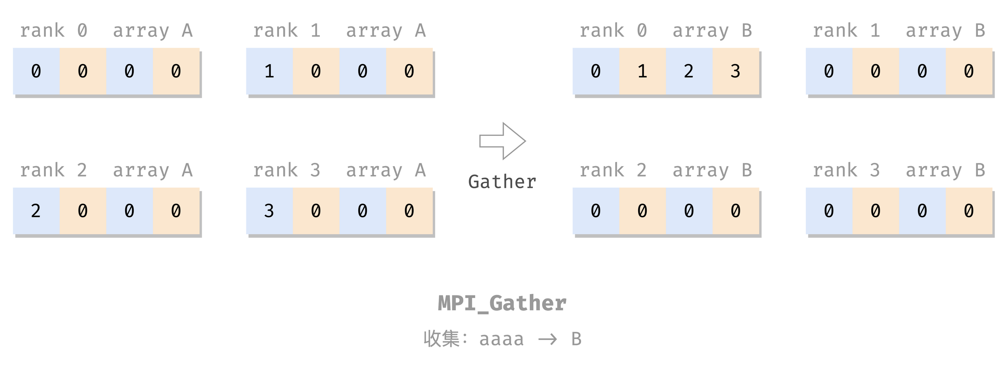
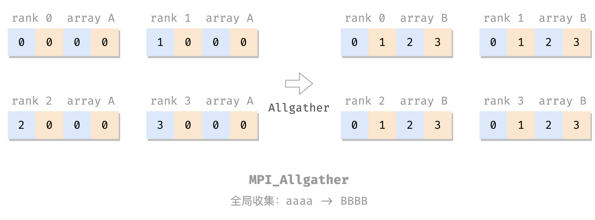
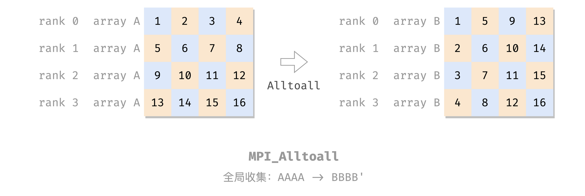

浅学 MPI。

# MPI

分布式内存多处理器：

- 处理器 + 辅助组件 => 节点
- 一堆节点 => 高性能计算系统
    - 节点 => 进程
- 节点之间：消息传递

MPI：消息传递接口

## 安装

还是用 Docker 方便。

宿主机：

```sh
sudo docker run -idt --name openmpi -v /home/openmpi/:/home/openmpi -p 22001:22 alpine

sudo ufw allow 22001 comment 'openmpi:ssh'

sudo docker exec -it openmpi sh
```

容器内：

```sh
apk add build-base  # 国内网络有时候要多运行几次
apk add perl  # Open MPI requires perl
apk add linux-headers  # #include <linux/unistd.h>
apk add bash vim
apk add gcompat libstdc++ curl

apk add openssh
vi /etc/ssh/sshd_config # PermitRootLogin yes
passwd # 重新设个 root 密码
/usr/sbin/sshd  # 开 ssh 服务后台

# 下载、安装 OpenMPI
wget https://download.open-mpi.org/release/open-mpi/v4.1/openmpi-4.1.4.tar.gz
tar xzf openmpi-4.1.4.tar.gz
cd openmpi-4.1.4
./configure --prefix=/usr/local
make all install

# 测试安装
cd /openmpi-4.1.4/examples/
mpicc -o hello_c hello_c.c
mpirun -n 4 --allow-run-as-root --oversubscribe hello_c
    # --allow-run-as-root: root 硬跑
    # --oversubscribe: 没有多处理器，单核单线程硬跑
```

退出来，宿主机，把刚才装好的做成镜像备用，可以方便以后重开：

```sh
sudo docker ps # 找一下刚才那个的 id
sudo docker commit 37c628532bae openmpi:v0.0.0
```

以后再次搭这个环境就方便了：

```sh
sudo docker run -idt --name openmpi -v /home/openmpi/:/home/openmpi -p 22001:22 openmpi:v0.0.0

# 这个没有 entrypoint，
# 如果要用 ssh，需要手动进去手动开一下 sshd
sudo docker exec -it openmpi-with-sshd sh
容器内 # /usr/sbin/sshd
```

看着多是由于好多步骤是在弄 SSH，弄好了 SSH，搭集群也就方便了。但我暂时没有兴趣。

## MPI 基本命令

```c
#include <mpi.h>  // 导入包

int main(int argc, char *argv[]) {
    MPI_Init(&argc, &argv);  // 任意其他 MPI 调用前
    ...
    MPI_Finalize(); // 任意其他 MPI 调用后
    ...
}
```

## Hello World

```c
#include <mpi.h>
#include <stdio.h>

int main(int argc, char** argv) {
    MPI_Init(&argc, &argv);
    
    printf("Hello, world!\n");
    
    MPI_Finalize();
    
    return 0;
}
```

编译运行：

```sh
$ mpicc hello.c -o hello
$ mpirun -n 4 --allow-run-as-root --oversubscribe hello
Hello, world!
Hello, world!
Hello, world!
Hello, world!
```

（`--allow-run-as-root` 和 `--oversubscribe` 是由于我要强制在单核单线程的虚拟机里用 Docker 里的 root 用户运行 MPI 程序，正常环境上不用。）

## 通信器

上面的 [Hello World](#Hello%20World)：无共享。每个进程做自己的，没有交互，无法协调工作。

MPI 的并发进程交互：**通信器**（communicator）：

- 地址空间：包含一组 MPI 进程
- 其他各种属性

MPI 自带提供一个开箱即用的通信器：`MPI_COMM_WORLD`，包含该 MPI 程序的所有并发进程。

### size & rank

`size` 和 `rank` 是两个常用的通信器属性。

- `size`：通信器的**大小**，即构成通信器的进程数量；
- `rank`：通信器中每个进程的标识（唯一进程 ID，$\ge 0$ 的整数），称为 rank；

两个属性的 getter（不是 setter）：

```c
int size, rank;

MPI_Comm_size(MPI_COMM_WORLD, /* out */ &size); 
MPI_Comm_rank(MPI_COMM_WORLD, /* out */ &rank);
```

（其实这两个函数有 `int` 类型的返回值，目测成功都是 0。）

e.g. 带 rank 和 size 的 Hello World：

```c
#include <mpi.h>
#include <stdio.h>

int main(int argc, char** argv) {
    MPI_Init(&argc, &argv);

    int size, rank;
    MPI_Comm_size(MPI_COMM_WORLD, &size);
    MPI_Comm_rank(MPI_COMM_WORLD, &rank);

    printf("Hello from rank %d out of %d processes in MPI_COMM_WORLD\n", rank, size);

    MPI_Finalize();

    return 0;
}
```

编译运行：

```c
# mpicc comm.c && mpirun -n 4 --allow-run-as-root --oversubscribe ./a.out
Hello from rank 0 out of 4 processes in MPI_COMM_WORLD
Hello from rank 2 out of 4 processes in MPI_COMM_WORLD
Hello from rank 1 out of 4 processes in MPI_COMM_WORLD
Hello from rank 3 out of 4 processes in MPI_COMM_WORLD
```

## 点对点消息

- MPI 负责管理通信器内的进程之间的数据交换
- MPI 数据交换的媒介：消息
    - 源进程 rank
    - 目标进程 rank
    - 包含源、目的进程的通信器
    - 标记：区分两个进程间的一组可能的消息，用户自定

### 发送

```c
MPI_Send(
    /* in */ void* message,
    int count, MPI_Datatype datatype,
    int dest, int tag, MPI_Comm comm)
```

发送的消息内容是：从 `message` 参数处开始的一个 `MPI_Datatype[count]` **数组**。

其中，`count` 是数据元素的数量（数组长度）；`MPI_Datatype` 为其类型，基本就是和 C 的简单数据类型一一对应：

| `MPI_Datatype`           | 对应的 C 数据类型           |
|------------------------|------------------------|
| `MPI_SHORT`              | `short int`              |
| `MPI_INT`                | `int`                    |
| `MPI_LONG`               | `long int`               |
| `MPI_LONG_LONG`          | `long long int`          |
| `MPI_UNSIGNED_CHAR`      | `unsigned char`          |
| `MPI_UNSIGNED_SHORT`     | `unsigned short int`     |
| `MPI_UNSIGNED`           | `unsigned int`           |
| `MPI_UNSIGNED_LONG`      | `unsigned long int`      |
| `MPI_UNSIGNED_LONG_LONG` | `unsigned long long int` |
| `MPI_FLOAT`              | `float`                  |
| `MPI_DOUBLE`             | `double`                 |
| `MPI_LONG_DOUBLE`        | `long double`            |
| `MPI_BYTE`               | `unsigned char`                   |

再次强调，MPI 发送的是数组。单发一个数 `int a` 也要将其看作 `int msg[1] = &a`，所以写作 `MPI_Send(&a, 1, MPI_INT, ...)`；而如果要发送一个数组 `int A[3]`，则不必再取地址：`MPI_Send(A, 3, MPI_INT, ...)`。

再次强调，MPI 发送的是数组，理解这点后再去看 MPI 接口，就没那么魔幻了，很多都是「数组首地址 + 长度 + 类型」这三个配套出现，可能有多组这个三元组，例如 [`MPI_Scatter`](#分散：Scatter)，后面再加上一个「源/目标进程号 + 通信器」。

### 接收

```c
MPI_Recv(
    /* out */ void* message,
    int count, MPI_Datatype datatype,
    int source, int tag, MPI_Comm comm,
    MPI_Status* status)
```

`status` 就是 `source` + `tag` + 可能的 error。

### 例子

把之前的带 rank 的 hello 改成顺序版本：

```c
#include <mpi.h>
#include <stdio.h>
#include <stdlib.h>
#include <string.h>

int main(int argc, char **argv) {
    MPI_Init(&argc, &argv);

    int rank, size;
    MPI_Comm_rank(MPI_COMM_WORLD, &rank);
    MPI_Comm_size(MPI_COMM_WORLD, &size);

    if (size == 1) {
        printf("This example requires more than one process to execute.\n");
        MPI_Finalize();
        exit(1);
    }

    // 消息收发的参数
    int message[2];  // buffer
    int dst, src;
    int tag = 0;
    MPI_Status status;

    if (rank != 0) {  // 给进程 0 发消息
        message[0] = rank;
        message[1] = size;

        dst = 0;

        MPI_Send(message, 2, MPI_INT, dst, tag, MPI_COMM_WORLD);
    } else {  // 进程 0：顺序收消息
        for (src = 1; src < size; src++) {
            MPI_Recv(message, 2, MPI_INT, src, MPI_ANY_TAG, MPI_COMM_WORLD, &status);

            printf("Hello from process %d out of %d.\n",
                   message[0], message[1]);
        }
    }

    MPI_Finalize();
    return 0;
}
```

编译运行：

```sh
$ mpicc send-recv.c && mpirun -n 4 --allow-run-as-root --oversubscribe ./a.out
Hello from process 1 out of 4.
Hello from process 2 out of 4.
Hello from process 3 out of 4.
```

这个程序用上 master-worker 模式了：

- rank 为 0 的进程是 master，负责顺序收消息、打印；
- rank 为其他值的进程是 worker，负责发一条消息给 master；
- `if-else` 分化 master 和 worker 的工作。

## 聚合通信

聚合通信：包含通信器内的所有进程的通信模式（群消息）

### 同步：Barrier

Barrier：栅栏：
- 所有人都堵在这里等；
- 所有人都到齐了再放行。

> 栅（zhà）栏，居然不是读 shān，我说咋老是打不出来。。。另外原来 zhà 栏是这个字啊，从未设想过😭

```c
MPI_Barrier(MPI_Comm comm)
```

e.g. 又一个 Hello World：

```c
#include <mpi.h>
#include <stdio.h>

int main(int argc, char** argv) {
    MPI_Init(&argc, &argv);

    MPI_Barrier(MPI_COMM_WORLD);

    int size, rank;
    MPI_Comm_size(MPI_COMM_WORLD, &size);
    MPI_Comm_rank(MPI_COMM_WORLD, &rank);

    int len;
    char name[MPI_MAX_PROCESSOR_NAME];
    MPI_Get_processor_name(name, &len);

    MPI_Barrier(MPI_COMM_WORLD);

    printf("Hello, world! Process %d of %d on %s\n", rank, size, name);

    MPI_Finalize();
    return 0;
}
```

编译运行：

```c
$ mpicc barrier.c && mpirun -n 4 --allow-run-as-root --oversubscribe ./a.out
Hello, world! Process 0 of 4 on c8e9719000d7
Hello, world! Process 2 of 4 on c8e9719000d7
Hello, world! Process 3 of 4 on c8e9719000d7
Hello, world! Process 1 of 4 on c8e9719000d7
```

联想：OpenMP 的 [barrier 指令](OpenMP.md#barrier%20指令)。

### 广播：Bcast


```c
MPI_Bcast(
    void *shared_data,
    int count, MPI_Datatype datatype,
    int root, MPI_Comm comm)
```

把 `root` 的 `shared_data` 广播（同步）给各进程的 `shared_data` 里。

e.g.

```c
#include <mpi.h>
#include <stdio.h>

int main(int argc, char** argv) {
    MPI_Init(&argc, &argv);

    int size, rank;
    MPI_Comm_size(MPI_COMM_WORLD, &size);
    MPI_Comm_rank(MPI_COMM_WORLD, &rank);

    int A[4];
    for (int i = 0; i < 4; i++) {
        A[i] = 0;
    }

    int root = 0;  // root process

    if (rank == root) {
        A[0] = 3;
        A[1] = 5;
        A[2] = 4;
        A[3] = 1;
    }

    MPI_Bcast(A, 4, MPI_INT, root, MPI_COMM_WORLD);

    printf("Rank %d: A = [%d, %d, %d, %d]\n", rank, A[0], A[1], A[2], A[3]);

    MPI_Finalize();
    return 0;
}
```

编译运行：

```sh
$ mpicc bcast.c && mpirun -n 4 --allow-run-as-root --oversubscribe ./a.out
Rank 0: A = [3, 5, 4, 1]
Rank 1: A = [3, 5, 4, 1]
Rank 2: A = [3, 5, 4, 1]
Rank 3: A = [3, 5, 4, 1]
```

### 分散：Scatter


```c
MPI_Scatter(
    void *send_data, int send_count, MPI_Datatype send_type,
    void *recv_data, int recv_count, MPI_Datatype recv_type,
    int root, MPI_Comm comm);
```

把 `root` 的 `send_data` 分散到各个进程的 `recv_data` 里，包括自己的，每个人发 `send_count` 个。

e.g.

```c
#include <mpi.h>
#include <stdio.h>
#include <stdlib.h>

int main(int argc, char** argv) {
    MPI_Init(&argc, &argv);

    int size, rank;
    MPI_Comm_size(MPI_COMM_WORLD, &size);
    MPI_Comm_rank(MPI_COMM_WORLD, &rank);

    if (size != 4) {
        printf("This example requires 4 processes to execute.\n");
        MPI_Finalize();
        exit(1);
    }

    int A[4], B[4];
    for (int i = 0; i < 4; i++) {
        A[i] = 0;
        B[i] = 0;
    }

    int root = 0;  // root process

    if (rank == root) {
        A[0] = 3;
        A[1] = 5;
        A[2] = 4;
        A[3] = 1;
    }

    MPI_Scatter(A, 1, MPI_INT,
                B, 1, MPI_INT,
                root, MPI_COMM_WORLD);

    printf("Rank %d: A = [%d, %d, %d, %d], B = [%d, %d, %d, %d]\n", rank, 
           A[0], A[1], A[2], A[3], 
           B[0], B[1], B[2], B[3]);

    MPI_Finalize();
    return 0;
}
```

编译运行：

```sh
$ mpicc scatter.c && mpirun -n 4 --allow-run-as-root --oversubscribe ./a.out
Rank 0: A = [3, 5, 4, 1], B = [3, 0, 0, 0]
Rank 1: A = [0, 0, 0, 0], B = [5, 0, 0, 0]
Rank 2: A = [0, 0, 0, 0], B = [4, 0, 0, 0]
Rank 3: A = [0, 0, 0, 0], B = [1, 0, 0, 0]
```

### 收集：Gather



```c
MPI_Gather(
    void *send_data, int send_count, MPI_Datatype send_type,
    void *recv_data, int recv_count, MPI_Datatype recv_type,
    int dest, MPI_Comm comm);
```

`MPI_Gather` 就是做反向的 [MPI_Scatter](#分散：Scatter)：把各个进程的 `send_data` 收集到 `dest` 的 `recv_data` 里。

e.g.

```c
#include <mpi.h>
#include <stdio.h>
#include <stdlib.h>

int main(int argc, char** argv) {
    MPI_Init(&argc, &argv);

    int size, rank;
    MPI_Comm_size(MPI_COMM_WORLD, &size);
    MPI_Comm_rank(MPI_COMM_WORLD, &rank);

    /* assert size == 4 */

    int A[4], B[4];
    for (int i = 0; i < 4; i++) {
        A[i] = 0;
        B[i] = 0;
    }

    A[0] = rank;  // 各自进程的结果

    int dest = 0; // 收集到 dest

    MPI_Gather(A, 1, MPI_INT,
               B, 1, MPI_INT,
               dest, MPI_COMM_WORLD);

    printf("Rank %d: A = [%d, %d, %d, %d], B = [%d, %d, %d, %d]\n", rank, 
           A[0], A[1], A[2], A[3], 
           B[0], B[1], B[2], B[3]);

    MPI_Finalize();
    return 0;
}
```

编译运行：

```sh
$ mpicc gather.c && mpirun -n 4 --allow-run-as-root --oversubscribe ./a.out
Rank 0: A = [0, 0, 0, 0], B = [0, 1, 2, 3]
Rank 1: A = [1, 0, 0, 0], B = [0, 0, 0, 0]
Rank 2: A = [2, 0, 0, 0], B = [0, 0, 0, 0]
Rank 3: A = [3, 0, 0, 0], B = [0, 0, 0, 0]
```

### 全局收集：Allgather



```c
MPI_Gather(
    void *send_data, int send_count, MPI_Datatype send_type,
    void *recv_data, int recv_count, MPI_Datatype recv_type,
    MPI_Comm comm);
```

类似于 [MPI_Gather](#收集：Gather)，但是收集的结果是广播到所有进程上的，而不是上缴到 dest（所以也就没这个参数了）。

e.g.

```c
#include <mpi.h>
#include <stdio.h>
#include <stdlib.h>

int main(int argc, char** argv) {
    MPI_Init(&argc, &argv);

    int size, rank;
    MPI_Comm_size(MPI_COMM_WORLD, &size);
    MPI_Comm_rank(MPI_COMM_WORLD, &rank);

    /* assert size == 4 */

    int A[4], B[4];
    for (int i = 0; i < 4; i++) {
        A[i] = 0;
        B[i] = 0;
    }

    A[0] = rank;  // 各自进程的结果

    MPI_Allgather(A, 1, MPI_INT,
                  B, 1, MPI_INT,
                  MPI_COMM_WORLD);

    printf("Rank %d: A = [%d, %d, %d, %d], B = [%d, %d, %d, %d]\n", rank, 
           A[0], A[1], A[2], A[3], 
           B[0], B[1], B[2], B[3]);

    MPI_Finalize();
    return 0;
}
```

编译运行：

```sh
$ mpicc allgather.c && mpirun -n 4 --allow-run-as-root --oversubscribe ./a.out
Rank 0: A = [0, 0, 0, 0], B = [0, 1, 2, 3]
Rank 1: A = [1, 0, 0, 0], B = [0, 1, 2, 3]
Rank 2: A = [2, 0, 0, 0], B = [0, 1, 2, 3]
Rank 3: A = [3, 0, 0, 0], B = [0, 1, 2, 3]
```

### 规约：Reduce

关于「规约」、「reduce」的词意以及这个过程的示意图，见 OpenMP 的 [reduction 指令](OpenMP.md#reduction%20指令)。

```c
MPI_Reduce(const void *send_data, void *recv_data,
           int count, MPI_Datatype datatype, 
           MPI_Op op,
           int dest, MPI_Comm comm);
```

每个进程发 `count` 个 `datatype` 类型的本地结果 `send_data` 到 `dest`，`dest` 将这些结果做 `op` 运算，结果放到 `recv_data`。

`op` 可以是：

- `MPI_MAX`、`MPI_MIN`
- `MPI_SUM`、`MPI_PROD`
- `MPI_LAND`（逻辑与）、`MPI_BAND`（按位与），类似的还有 OR、XOR。要求 datatype 是整型
- `MPI_MAXLOC`（最大值**和**其位置）、`MPI_MINLOC`。要求 datatype 是对：`MPI_DOUBLE_INT` 或 `MPI_2INI`

e.g. 计算两个向量的点积：$a \cdot b = \sum_i a_i b_i$：

具体来说就是做这件事：

$$
\begin{array}{rll}
a \cdot b =&\  [\underbrace{1,\cdots,1}_\textrm{100个1},2,\cdots,2,\cdots] \times [2,\cdots,2]^T\\
~ =&\ \underbrace{1 \times 2 + \cdots +1 \times 2}_\textrm{100次} +\\
~ &\  2 \times 2 + \cdots + 2 \times 2 +\\
~ &\  \cdots
\end{array}
$$

其中，最后一个等号右边每一行由一个进程来算，行之间加起来用 reduce 来做。

```c
#include <mpi.h>
#include <stdio.h>
#include <stdlib.h>

int main(int argc, char **argv) {
    MPI_Init(&argc, &argv);

    int size, rank;
    MPI_Comm_size(MPI_COMM_WORLD, &size);
    MPI_Comm_rank(MPI_COMM_WORLD, &rank);

    int local_vector_size = 100;
    int global_vector_size = size * local_vector_size;

    double *a, *b;
    a = (double *) malloc(local_vector_size * sizeof(double));
    b = (double *) malloc(local_vector_size * sizeof(double));
    for (int i = 0; i < local_vector_size; i++) {
        a[i] = 1.0 * rank;
        b[i] = 2.0;
    }

    // 上面都是造数据
    // 下面正式开始算 dot product，两阶段：本地累积、全局规约
    
    double partial_sum = 0.0;
    for (int i = 0; i < local_vector_size; i++) {
        partial_sum += a[i] * b[i];
    }

    int root = 0;
    double sum = 0.0;
    MPI_Reduce(&partial_sum, &sum, 
               1, MPI_DOUBLE, MPI_SUM, 
               root, MPI_COMM_WORLD);

    if (rank == root) {
        printf("The dot product is %g\n", sum);
    }

    free(a);
    free(b);

    MPI_Finalize();
    return 0;
}
```

编译运行：

```sh
$ mpicc reduce.c && mpirun -n 4 --allow-run-as-root --oversubscribe ./a.out
The dot product is 1200
```

### 全局规约：Allreduce

类似于从 [`MPI_Gather`](#收集：Gather) 到 [`MPI_Allgather`](#全局收集：Allgather)，`MPI_Allreduce` 做  [`MPI_Reduce`](#规约：Reduce)  的运算，但是把结果广播到每一个进程（所以也就无需 dest 参数）。

```c
MPI_Allreduce(const void *send_data, void *recv_data,
              int count, MPI_Datatype datatype, 
              MPI_Op op,
              MPI_Comm comm);
```

e.g.

```c
#include <mpi.h>
#include <stdio.h>

int main(int argc, char **argv) {
    MPI_Init(&argc, &argv);

    int size, rank;
    MPI_Comm_size(MPI_COMM_WORLD, &size);
    MPI_Comm_rank(MPI_COMM_WORLD, &rank);

    int input = 0;
    switch (rank) {
        case 0: input = 2; break;
        case 1: input = 7; break;
        case 2: input = 1; break;
    }

    int output;
    MPI_Allreduce(&input, &output, 1, MPI_INT, MPI_SUM, MPI_COMM_WORLD);

    printf("Rank %d: result = %d.\n", rank, output);

    MPI_Finalize();
    return 0;
}
```

编译运行：

```sh
$ mpicc allreduce.c && mpirun -n 4 --allow-run-as-root --oversubscribe ./a.out
Rank 3: result = 10.
Rank 1: result = 10.
Rank 2: result = 10.
Rank 0: result = 10.
```

### 全局到全局：Alltoall

alltoall 通信模式：

- 每个发送器也是接收器；
- 不同的数据被发送到每个接收器：第 i 个数据分区被发送到第 j 个进程；

用每行表示一个进程，每列表示一个数据分区，则 alltoall 的效果类似于矩阵转置：



我的理解是 `Alltoall = Allscatter`，不知道对不对哈：

- 作 sender：每个进程把自己的数组 A 做 [`Scatter`](#分散：Scatter) 发到各个进程；
- 作 recver：进程 `i` 把各个进程发来的数（`A[i] from j`）按 sender 的 rank `j` 拼成新数组 B：`B[j] = A[i] form j`。

```c
MPI_Alltoall(
    void *send_data, int send_count, MPI_Datatype send_type,
    void *recv_data, int recv_count, MPI_Datatype recv_type,
    MPI_Comm comm);
```

e.g.

```c
#include <assert.h>
#include <mpi.h>
#include <stdio.h>
#include <stdlib.h>
#include <unistd.h>

int main(int argc, char **argv) {
    MPI_Init(&argc, &argv);

    int size, rank;
    MPI_Comm_size(MPI_COMM_WORLD, &size);
    MPI_Comm_rank(MPI_COMM_WORLD, &rank);

    assert((size == 4) && "this example is designed for 4 processes.");

    int A[4], B[4];

    for (int i = 0; i < 4; i++) {
        A[i] = i + 1 + 4 * rank;
    }

    MPI_Alltoall(A, 1, MPI_INT, B, 1, MPI_INT, MPI_COMM_WORLD);

    sleep(rank);
    printf("Rank %d: A = [%2d, %2d, %2d, %2d], B = [%2d, %2d, %2d, %2d]\n", rank, 
           A[0], A[1], A[2], A[3], 
           B[0], B[1], B[2], B[3]);

    MPI_Finalize();
    return 0;
}
```

编译运行：

```sh
$ mpicc alltoall.c && mpirun -n 4 --allow-run-as-root --oversubscribe ./a.out
Rank 0: A = [ 1,  2,  3,  4], B = [ 1,  5,  9, 13]
Rank 1: A = [ 5,  6,  7,  8], B = [ 2,  6, 10, 14]
Rank 2: A = [ 9, 10, 11, 12], B = [ 3,  7, 11, 15]
Rank 3: A = [13, 14, 15, 16], B = [ 4,  8, 12, 16]
```

## 非阻塞通信

上文的 [点对点消息](#点对点消息) 和 [聚合通信](#聚合通信) 都是阻塞的：发/收 完成之前，函数不会返回。

MPI 还提供了非阻塞的接口：

```c
MPI_Isend(
    void* message,
    int count, MPI_Datatype datatype,
    int dest, int tag, MPI_Comm comm,
    MPI_Request *send_request)

MPI_Irecv(
    void* message,
    int count, MPI_Datatype datatype,
    int source, int tag, MPI_Comm comm,
    MPI_Request *recv_request)

// 还有类似的 MPI_Ibarrier, MPI_Ibcast, 
// MPI_Iscatter, MPI_Igather
// MPI_Ialltoall, MPI_Iallgather
// MPI_Ireduce, ...
```

就是函数名 `MPI_Xxx` -> `MPI_Ixxx`，参数最后加一个 `MPI_Request`，用于跟踪该异步通信。这些函数在调用后立即返回。

欲知异步通信是否完成，使用 `MPI_Test`，把 `MPI_Ixxx` 的 request 传进来，检查，已完成则置 flag 的值为真：

```c
MPI_Test(MPI_Request *request, int *flag, MPI_Status *status);
```

在必须完成异步通信时，使用 `MPI_Wait`，阻塞，等通信完成：

```c
MPI_Wait(MPI_Request *request, MPI_Status *status);
```

用非阻塞通信有一个好处是，可以防呆，避免一些程序顺序瑕疵可能带来的死锁问题。考虑如下程序：

```c
#include <assert.h>
#include <mpi.h>
#include <stdio.h>
#include <stdlib.h>

int main(int argc, char **argv) {
    MPI_Init(&argc, &argv);

    int rank, size;
    MPI_Comm_rank(MPI_COMM_WORLD, &rank);
    MPI_Comm_size(MPI_COMM_WORLD, &size);

    assert(size == 2);

    int tag = 0;
    int a = rank, b = -1;

    // work
    MPI_Send(&a, 1, MPI_INT, 1 - rank, tag, MPI_COMM_WORLD);
    MPI_Recv(&b, 1, MPI_INT, 1 - rank, tag, MPI_COMM_WORLD, MPI_STATUS_IGNORE);

    printf("Rank %d: recv value %d.\n", rank, b);

    MPI_Finalize();
    return 0;
}
```

send 在前，recv 在后，可以工作。但如果交换二者顺序，就直接死锁（都先 recv，但没人发啊）：

```c
// DEADLOCK!!!
MPI_Recv(&b, 1, MPI_INT, 1 - rank, tag, MPI_COMM_WORLD, MPI_STATUS_IGNORE);
MPI_Send(&a, 1, MPI_INT, 1 - rank, tag, MPI_COMM_WORLD);
```

改成非阻塞通信：

```c
#include <assert.h>
#include <mpi.h>
#include <stdio.h>
#include <stdlib.h>

int main(int argc, char **argv) {
    MPI_Init(&argc, &argv);

    int rank, size;
    MPI_Comm_rank(MPI_COMM_WORLD, &rank);
    MPI_Comm_size(MPI_COMM_WORLD, &size);

    assert(size == 2);

    int tag = 0;
    MPI_Status status;
    MPI_Request send_req, recv_req;

    int a = rank, b = -1;

    // 可以交换
    MPI_Isend(&a, 1, MPI_INT, 1 - rank, tag, MPI_COMM_WORLD, &send_req);
    MPI_Irecv(&b, 1, MPI_INT, 1 - rank, tag, MPI_COMM_WORLD, &recv_req);

    // 可以交换
    MPI_Wait(&send_req, &status);
    MPI_Wait(&recv_req, &status);

    printf("Rank %d: recv value %d.\n", rank, b);

    MPI_Finalize();
    return 0;
}
```

编译运行：

```c
Rank 0: recv value 1.
Rank 1: recv value 0.
```

交换 `Isend` 和 `Irecv`，程序也正常工作。交换两句 `Wait`，也正常工作。所以这个就很舒服了。

## 自定义数据类型

```c
MPI_Type_create_struct(int count, 
    const int array_of_block_lengths[],
    const MPI_Aint array_of_displacements[],
    const MPI_Datatype array_of_types[],
    MPI_Datatype *newtype);

MPI_Type_commit(MPI_Datatype *newtype);
```

e.g.

```c
#include <mpi.h>
#include <stdio.h>
#include <stdlib.h>

typedef struct {
    int x;
    double y;
} Pair;

int main(int argc, char **argv) {
    MPI_Init(&argc, &argv);

    int rank, size;
    MPI_Comm_rank(MPI_COMM_WORLD, &rank);
    MPI_Comm_size(MPI_COMM_WORLD, &size);

    // 要动态创建的新 mpi 类型
    MPI_Datatype mpi_pair;

    int nitems = 2;              // # fields of Pair
    MPI_Datatype types[nitems];  // element types
    MPI_Aint offsets[nitems];    // element offsets
    int blocklengths[nitems];    // element count

    // Pair.x
    types[0] = MPI_INT;
    offsets[0] = offsetof(Pair, x);
    blocklengths[0] = 1;

    // Pair.y
    types[1] = MPI_DOUBLE;
    offsets[1] = offsetof(Pair, y);
    blocklengths[1] = 1;

    // 注册类型
    MPI_Type_create_struct(nitems, blocklengths, offsets, types, &mpi_pair);
    MPI_Type_commit(&mpi_pair);

    // 然后就可以把 Pair 结构体用 MPI 通信了

    int root = 0;

    Pair pair;
    if (rank == root) {
        pair.x = 10;
        pair.y = 3.14;
    }

    MPI_Bcast(&pair, 1, mpi_pair, root, MPI_COMM_WORLD);

    printf("Rank %d: recv Pair{x=%d, y=%g}\n", rank, pair.x, pair.y);

    MPI_Finalize();
    return 0;
}
```

编译运行：

```sh
$ mpicc newtype.c && mpirun -n 4 --allow-run-as-root --oversubscribe ./a.out
Rank 0: recv Pair{x=10, y=3.14}
Rank 1: recv Pair{x=10, y=3.14}
Rank 3: recv Pair{x=10, y=3.14}
Rank 2: recv Pair{x=10, y=3.14}
```

---

## 参考文献

- Thomas Sterling，Matthew Anderson，Maciej Brodowicz. 高性能计算：现代系统与应用实践. 第 8 章 MPI 的基础
- OpenMPI 官网: https://www.open-mpi.org/
- 下载地址: https://www.open-mpi.org/software/ompi/v4.1/
- 安装文档: https://www.open-mpi.org/faq/?category=building#easy-build

---

EOF
