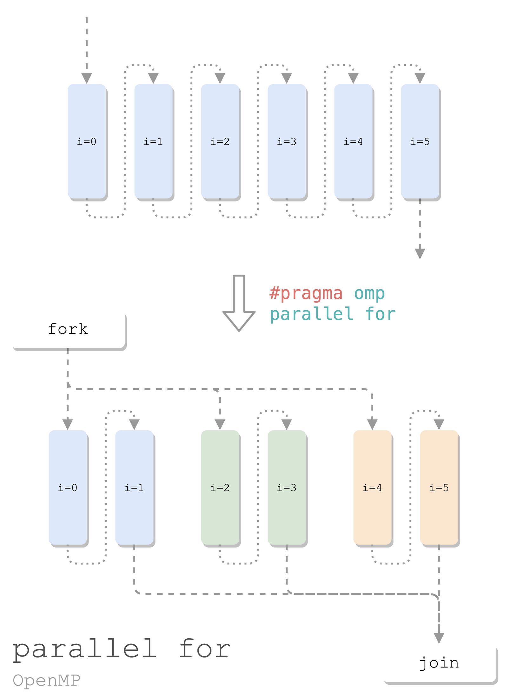
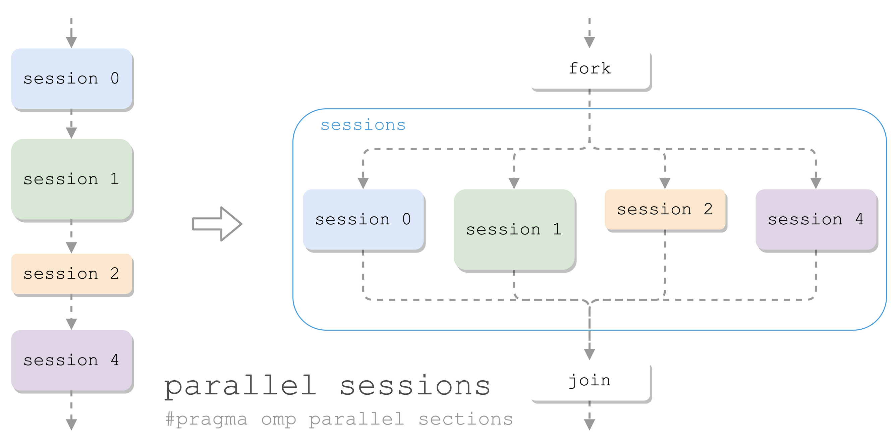
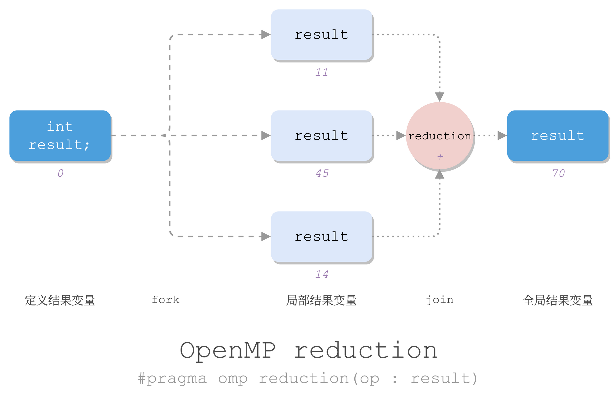

> 学习《高性能计算：现代系统与应用实践》（Thomas Sterling，Matthew Anderson，Maciej Brodowicz）第 7 章 OpenMP 的基础

# OpenMP

- OpenMP 是一个 API
    - C、C++、Fortran
- OpenMP 是**共享内存**的*多线程*编程模型
    - 共享内存
        - 默认所有线程可以直接访问全局变量
        - 可以限制变量为各线程私有（e.g. 索引变量 `i`）
    - 线程并行
        - master/worker 线程：fork-join 模型
        - 分支：SPMD（单程序多数据）
        - 聚合：隐式栏栅同步：超出当前访问前，所有线程都要完成


## 环境变量

```sh
export OMP_NUM_THREADS=8  # 开几个线程，默认自动看 CPU
export OMP_DYNAMIC=TRUE   # 动态线程数量
export OMP_NESTED=TRUE    # 允许嵌套并行
export OMP_SCHEDULE=schedule.chunk  # 循环的负载分布
```

## 使用 OpenMP

不用安装：
- GCC 内置了 OpenMP 支持！
- 编译的时候带上 `-fopenmp` 就行。

导入：

```c
#include <omp.h>
```

基本函数：

```c
omp_get_num_threads()  // 有多少个并行的进程: OMP_NUM_THREADS
omp_get_thread_num()   // 我(当前进程)的 id
                       // master: 0; worker: [1, OMP_NUM_THREADS)
```

OpenMP 指令（制导语句）：

```c
#pragma omp <directive> <clauses> <statement>
```

### Hello World

```c
// hello.c

#include <omp.h>
#include <stdio.h>

int main() {
#pragma omp parallel
    {  // fork
        int num_threads = omp_get_num_threads();
        int thread_id = omp_get_thread_num();
        printf("Hello world from %d (total %d)\n", thread_id, num_threads);
    }  // join

    return 0;
}
```

魔法是 `#pragma omp parallel`：串行 -> 并行。派生出 `OMP_NUM_THREADS` 个进程来并行跑其后的一个代码块。

编译运行：

```sh
$ gcc-11 -fopenmp hello.c
$ ./a.out
Hello world from 1 (total 4)
Hello world from 0 (total 4)
Hello world from 3 (total 4)
Hello world from 2 (total 4)
```

顺序是那种乱七八糟的：并行。觉得不明显可以指定线程数量，再运行：

```sh
$ OMP_NUM_THREADS=100 ./a.out
Hello world from 2 (total 100)
Hello world from 11 (total 100)
...
Hello world from 35 (total 100)
...
Hello world from 0 (total 100)
Hello world from 98 (total 100)
```

### 私有变量

上面那个程序的另一种版本：

- 预先定义两个变量，但是指定为各线程私有
- 只让 id 为 0 的进程，即**主线程**获取 `num_threads`
- （其实我试了，编译成汇编和上面那个区别不大，两个变量结束并行之后都不是有效值。~~所以目前还不清楚这样在外面先定义好变量有啥优势~~ 这个问题大致有答案了，见后文：[[#Why private]]。我还是喜欢局部变量就局部去定义。） ^b5e08c

```c
// hello-v2.c

#include <omp.h>
#include <stdio.h>

int main() {
    int num_threads, thread_id;

#pragma omp parallel private(num_threads, thread_id)
    {
        thread_id = omp_get_thread_num();
        printf("Hello world from thread %d.\n", thread_id);

        if (thread_id == 0) {
            num_threads = omp_get_num_threads();
            printf("Total number of thread is: %d\n", num_threads);
        }
    }

    // printf("End of parallel: %d, %d\n", thread_id, num_threads);
    // End of parallel: 1, 61694048

	return 0;
}
```

编译运行：

```sh
$ gcc-11 -fopenmp hello-v2.c; ./a.out 
Hello world from thread 0.
Total number of thread is: 4
Hello world from thread 3.
Hello world from thread 2.
Hello world from thread 1.
```

---
小结：OpenMP 并行：

```c
#include <omp.h>

int main() {
    #pragma omp parallel
    {
        并行的代码;
    }
}
```

- 默认各线程共享上下文中的变量：在 `omp parallel` 后面加 `private(...)` 指定要各线程私有的变量。

## OpenMP 并行

### 并行 for



线程间循环分布：通过 OpenMP，让多个线程同时（并行）处理一个 `for` 循环。

```c
#include <stdio.h>
#include <stdlib.h>

int main() {
    const int N = 20;
    int num_threads, thread_id;

    double a[N], b[N], result[N];
    for (int i = 0; i < N; i++) {
        a[i] = 1.0 * i;
        b[i] = 100.0 * i;
    }

    for (int i = 0; i < N; i++) {
        result[i] = a[i] + b[i];
    }

    printf("TEST result[19]=%g\n", result[19]);
    // TEST result[19]=1919
    return 0;
}
```

要并行化处理合并两个数组的操作，只需加 5 行：

```c
#include <omp.h>  // +1

int main() {
    ...

    #pragma omp parallel  // +2
    {  // +3
        #pragma omp for  // +4
        for (int i = 0; i < N; i++) {
            printf("%d: i=%d\n", omp_get_thread_num(), i);
            result[i] = a[i] + b[i];
        }
    }  // +5
    
    printf("TEST result[19]=%g\n", result[19]);
    return 0;
}
```

此处的魔法是 `#pragma omp for`，把 for 分配给各个线程。中间额外加了一个 printf，可以看到 20 次循环，被几个线程平分：

```sh
0: i=0  ... 0: i=4
2: i=10 ... 2: i=14
3: i=15 ... 3: i=19
1: i=5  ... 1: i=9
TEST result[19]=1919
```

如果露掉这一行  `#pragma omp for`，OpenMP 便无从得知你要并行这个 for。那就比较“精彩”了，4 个线程，把循环各跑一遍，极致反向优化：

```sh
0: i=0 ... 0: i=19
1: i=0 ... 1: i=19
2: i=0 ... 2: i=19
3: i=0 ... 3: i=19
TEST result[19]=1919
```

这个操作太常用了，所以有简化的写法：

```c
#pragma omp parallel for
for (int i = 0; i < N; i++) {
    printf("%d: i=%d\n", omp_get_thread_num(), i);
    result[i] = a[i] + b[i];
}
```

---

小结：并行 for：

```c
#pragma omp parallel
{
    #pragma omp for
    for (;;) {}
}

⬇️ 复合魔法

#pragma omp parallel for
for (;;) {}
```

- 可选：`omp for` 后面加子句 `schedule(static.chunk)`，指定切分循环的方式。

### 并行 sections



有多块代码要并发执行：
- 一个块称为一个 section
- 多个 section 在一个 sections 中并行
- 一个线程处理一个 section

```c
#pragma omp parallel
{
    #pragma omp sections
    {
        { /* section 0 */ }

        #pragma omp section
        { /* section 1 */ }

        #pragma omp section
        { /* section 2 */ }

        ...
    }
}
```

类似于 `parallel for`，如果开并行只是为了执行 sections，也可以用合并的 `parallel sections`：

```c
#pragma omp parallel sections
{
    { /* section 0 */ }

    #pragma omp section
    { /* section 1 */ }

    ...
}
```

一个例子：并行地对一列数据进行统计，求最值、均值、方差：

```c
#include <omp.h>
#include <stdio.h>
#include <stdlib.h>

int main() {
    const int N = (1<<29);  // N doubles: 4 GiB
    // const int N = 10;
    double *x = calloc(N, sizeof(double));
    // #pragma omp parallel for  // 初始化
    for (int i = 0; i < N; i++) {
        x[i] = i;
    }

    // 总和、均值、平方的总和
    double sum = 0.0, avg = 0.0, sum2 = 0.0;

    #pragma omp parallel sections shared(x, sum, avg, sum2)
    {
        // section 0: 计算 最大最小值
        {
            double max = (1<<31), min = (1<<31) - 1;
            for (int i = 0; i < N; i++) {
                if (x[i] < min) min = x[i];
                if (x[i] > max) max = x[i];
            }
            printf("min: %f\nmax: %f\n", min, max);
        }

        #pragma omp section  // section 1: 计算总和、均值
        {
            for (int i = 0; i < N; i++) {
                sum += x[i];
            }
            printf("sum: %f\n", sum);

            avg = sum / N;
            printf("avg: %f\n", avg);
        }

        #pragma omp section  // section 2: 计算平方的均值
        {
            for (int i = 0; i < N; i++) {
                sum2 += x[i] * x[i];
            }
            printf("sum2: %f\n", sum2);
        }
    }

    // 方差 = 平方的均值 - 均值的平方
    double var = sum2 / N - avg * avg;
    printf("var: %f\n", var);

    return 0;
}
```

注意这里使用了全局共享的 `sum` 等几个量，是为了在并行结束后，留下这些值，用于计算方差。

编译运行，对比去掉 parallel 的版本，似乎有一定的提升：

```sh
$ openmp gcc-11 -fopenmp sections.c; time ./a.out    
min: 0.000000
max: 536870911.000000
sum2: 51580834826121141939077120.000000
sum: 144115187606093856.000000
avg: 268435455.125000
var: 24019198213991840.000000
./a.out  7.34s user 4.00s system 101% cpu 11.200 total

$ openmp gcc-11 -fopenmp no-sections.c; time ./a.out    
min: 0.000000
max: 536870911.000000
sum: 144115187606093856.000000
avg: 268435455.125000
sum2: 51580834826121141939077120.000000
var: 24019198213991840.000000
./a.out  8.41s user 9.52s system 72% cpu 24.587 total
```

## OpenMP 同步

共享内存：

- OpenMP 的多个并发线程之间共享全局数据
- 无需 send/recv 的消息传递在并发进程之间交换数值

同步机制：

- **协调**并行程序中多个并行线程的执行
- 控制顺序：避免竞争 -> 冲突
- 隐式：join 栅栏
- 显示：critical、master、barrier、single

### critical 指令

临界同步指令 `critical`：多个并行线程互斥访问共享变量。

```c
#paragma omp critical
{ ... }
```

e.g. 尝试做个并行计数器：

```c
#include <omp.h>
#include <stdio.h>

int main() {
    int n = 0;

    #pragma omp parallel for shared(n)
    for (int i=0; i < 40000; i++) {
        #pragma omp critical
        n = n + 1;
    }

    printf("n: %d\n", n);
    return 0;
}
```

编译运行（运行了很多次都是对的）：

```sh
$ openmp gcc-11 -fopenmp critical.c; time  OMP_NUM_THREADS=1000 ./a.out    
n: 40000
OMP_NUM_THREADS=1000 ./a.out  0.01s user 0.05s system 16% cpu 0.390 total
```

如果删掉 `#pragma omp critical`，就会出现喜闻乐见的错误结果（多运行一些次就能看到各种不同的错误结果）：

```sh
$ openmp gcc-11 -fopenmp no-critical.c; time  OMP_NUM_THREADS=1000 ./a.out    
n: 39960
OMP_NUM_THREADS=1000 ./a.out  0.01s user 0.06s system 63% cpu 0.104 total
```

### master 指令

`master` 指令：只有主线程执行这一块代码，其他线程遇到则跳过。

- 主线程：执行这一块代码
- 其他线程：直接往下走，不等

```c
#pragma omp master
{ ... }
```

### barrier 指令

`barrier` 指令：同步所有并发线程：
- 遇到 barrier 的线程就停下来，等；
- 等所有进程都到了 barrier 才能继续。

```c
#pragma omp barrier
```

### single 指令

`single` 指令：宽松版 `master` + 隐式  `barrier`：

- 在代码块（`{ ... }`）**后面**放一个隐式 barrier；
- 允许任意线程 Foo 执行代码块；
- 其他线程跳过代码块执行，但是阻塞在 barrier，等 Foo 酱执行完代码块再放行。

```c
#pragma omp single
{ ... }
```

### reduction 指令

**规约**：将大量值组合在一起，生成单个结果值。

> Reduction：the action or fact of making a specified thing smaller or less in amount, degree, or size
> —— New Oxford American Dictionary
> 
> 这里所谓规约就是让值的个数变少的操作。（回想一下 Lisp 就很形象了。）

OpenMP 可以用 `reduction` 指令做规约：

```c
double result;

#pragma omp reduction(op : result)
{
    result = ...;  // 局部 result
}

// 全局 result: result = reduce(op, results)
```

- `op` 为某种运算：`+`，`-`，`*`，`/`，`&`，`|`，`^` 中的一个；
    - 更复杂的规约也容易使用其他[同步](#OpenMP%20同步)的方式实现。
- `result` 为结果变量，注意这个值在块内是各线程私有，出来之后变成全局的、规约得到的结果。



e.g.

```c
#include <stdio.h>
#include <omp.h>

int main() {
    const int N = 16;
    float a[N], b[N], result;

    for (int i = 0; i < N; i++) {
        a[i] = i * 1.0;
        b[i] = i * 2.0;
    }

    #pragma omp parallel for reduction(+ : result)
    for (int i = 0; i < N; i++) {
        result += a[i] * b[i];
    }

    printf("Result = %f\n", result);
    
    return 0;
}
```

编译运行：

```sh
$ gcc-11 -fopenmp reduction.c; ./a.out    
Result = 2480.000000
```

## 闲聊

### Why pragma

`#pragma` 是什么鬼啊？`pragma` 来源于 pragmatic（务实的），，所以关联的点是什么。。

Pragma，也叫做 directive。Directive 就是“指示”的意思，不知到是如何惨遭毒手，被翻译为“制导语句”的。。不翻译成“42 号混凝土”我是不敢苟同的。

总之这东西就是用来指导编译器如何编译的。（教编译器做事）

（对了，我最讨厌这种要左手连打几个字母的词了，顺便吐槽一下“Database”，这个词简直了，尤其是要大写时。其实换一种角度来考虑，还是键盘键位设计的锅。）

### Why private

`private` 子句有何用？[[#^b5e08c|前文]]提到，在各线程内定义局部变量可以完全避免 `private`，但这是站在一开始就编写 OpenMP 并行代码的角度来设计得到的结果。

OpenMP 设计的一项初衷是在**尽可能少改动**原有串行代码的基础上，加入并行支持。理想的情况只需加入尽可能少的制导语句（`#pragma omp parallel`、`#pragma omp parallel for` 等）就可以让原本串行的代码变并行。

所以就有这种场景：原本的代码如下：

```c
int i, j;
for(i = 0; i < n; i++) {
      for(j = 0; j < n; j++) {
          //do something
      }
}
```

要使其支持并发，有 `private` 的支持，只需加一行制导语句，完全不需要改动原有任何一行代码：

```c
int i, j;
#pragma omp parallel for private(j)
for(i = 0; i < n; i++) {
    for(j = 0; j < n; j++) {
        //do something
    }
}
```

但如果没有 `private`，就需要改动原有代码结构，把 `j` 的定义移动到第一层循环内：

```c
int i;
#pragma omp parallel for
for(i = 0; i < n; i++) {
    int j;
    for(j = 0; j < n; j++) {
        //do something
    }
}
```

如果需要为 `C89` （所有变量定义要写到 scope 顶部）写的代码加入并行性，这个 `private` 对于还是比较有意义的。

所以更多是一种兼容性吧。

---

最近学这些计算（有没有一种可能计算机本来就是用来做计算的😭），还真有好多代码是八几年、九几年写的，有些甚至写的是 K&R C，一直沿用至今，正确、高效、优雅、美观，真的 nb（褒义，由衷赞叹，写的确实漂亮，以带着最深沉偏见的、最批判的锋利目光去看，也无可挑剔）。

再看看现在好多所谓学“\*”的 \* 写的代码，我没有针对 \* 语言，我是说 \* 写的任何程序，真的 nb（贬义。那些“代码”，笑死，看别人接手是喜剧，要自己接手是悲剧；眼睁睁看着别人写出这种代码是人间炼狱）。

- [StackOverflow: OpenMP: are local variables automatically private?](https://stackoverflow.com/questions/6358375/openmp-are-local-variables-automatically-private)
- [StackOverflow: Is there any difference between variables in a private clause and variables defined within a parallel region in OpenMP?](https://stackoverflow.com/questions/23890539/is-there-any-difference-between-variables-in-a-private-clause-and-variables-defi/23892073#23892073)
- [StackOverflow: Variable declaration placement in C](https://stackoverflow.com/questions/288441/variable-declaration-placement-in-c)

