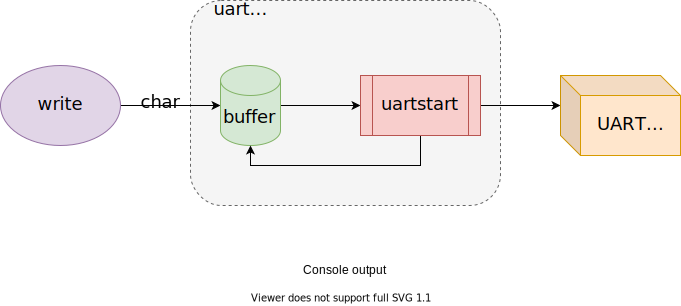

# Xv6 Interrupts and device drivers

> Learning: [xv6-riscv-book](https://github.com/mit-pdos/xv6-riscv-book) Chapter 5 Interrupts and device drivers

*Driver*: 

- code in an OS
- manages a particular device
  - config hardware
  - tells operations
  - handles resulting interrupts
  - interacts with processes

Devices -> driver -> interrupts (one type of trap)  -> OS

xv6 handles driver's interrupt in `devintr` ([kernel/trap.c:117](https://github.com/mit-pdos/xv6-riscv/blob/riscv//kernel/trap.c#L177))

---

Common driver: two contexts:

| context       | runs in                   | called                                                | perform                                                      |
| ------------- | ------------------------- | ----------------------------------------------------- | ------------------------------------------------------------ |
| *top half*    | a process's kernel thread | called via syscalls (e.g. read/write)                 | - ask hardware to start an operation<br />- waits for operation to complete |
| *bottom half* | excutes at interrupt time | device completes the  operation => raise an interrupt | as interrupt handler: <br />- what operation has completed?<br />- wakes up a waitting proc<br />- tells hw to do next operation |

## Console input

[`console.c`](https://github.com/mit-pdos/xv6-riscv/blob/riscv/kernel/console.c): console driver: a simple illustration of driver structure.

- accepts typed chars  via UART hardware
- accumulates a line
- processing sepcial input chars (e.g. `^H` for [backspace](https://en.wikipedia.org/wiki/Backspace), `^D` for [End-of-Transmission](https://en.wikipedia.org/wiki/End-of-Transmission_character))
- user processes use `read` to fetch inputed lines. 

QEMU: 

- keystrokes -> QEMU's simulated UART hardware

UART: 

- (QEMU hardware): emulated 16550 chip connected to keyboard and display.

- (appears to software): a set of *memory-mapped* control register. ([kernel/uart.c](https://github.com/mit-pdos/xv6-riscv/blob/riscv/kernel/uart.c))
  - `LSR`: wheter input chars are waiting to be read
  - `RHR`: chars to read (FIFO, if empty -> LSR.ready = 0)
  - ...
- initialize:  `consoleinit` ([kernel/console.c:182](https://github.com/mit-pdos/xv6-riscv/blob/077323a8f0b3440fcc3d082096a2d83fe5461d70/kernel/console.c#L182))
  - generate receive interrupts when the UART receive bytes from input
  - generate *transmit complete* interrupts when finished sending a byte of output

processes (e.g. shell): 

- [process] read from console (via file descriptor) -> 
- [kernel] `consoleread` -> 
- [consoleread] waits input (`sleep` to wait user typing) to arrive `cons.buf`, copies input to user space until  `\n` ->
- [kernel/consoleread] returns to user process

User types a character:

- UART hardware ask RISC-V to raise an interrupt
- activates xv6's trap handler
- handler calls `devintr`
- `devintr` looks `scause`: discover interrupt is from a device
- `devintr` ask PLIC hardware to tell which device interrupted
- if it was UART: calls `uartintr`
- `uartintr` reads input chars from UART hw
- hands chars to `consoleintr`
- `consoleintr`: accumulate input chars in `cons.buf` until a whole line arrives
- treats special chars (e.g. backspace)
- when a newline arrives: `consoleintr` wakes up a waiting `consoleread`

## Console output

- `write` to a fie descriptor connected  to console -> `uartputc`
- `uartputc` puts each char into an output buffer (`uart_tx_buf`), calls `uartstart`
- if buffer full -> `uartputc` waits
- `uartstart`: if device ready -> transmitting
- UART finishes sending a byte -> generates an interrupt
- interrupt -> `uartintr` -> `uartstart`




## Concurrency in drivers

*I/O concurrency*: 

- the decoupling of device activity from process activity via buffering and interrupts.
  - console driver can process input even when no process is waiting to read it
  - processes can send output without having to wait for the device

Concurrency dangers: 

- two processes on different CPUs call `consoleread` at the same time.
  - solve: acquire a lock
- one process waits for input, interrupt of the input arrive when a different process is running.
  - interrupt handlers copy input data to a buffer
  - wake up top-half code to do the rest (consoleintr -> consoleread)

## Timer interrupts

**Clock hardware**: 

- attached to each RISC-V CPU
- xv6 programs this clock hw to interrupt each CPU periodically

**Timer interrupt**:


clock hardware -> timer interrupt -(trap)-> usertrap / kerneltrap -> yield -> switch processes

RISC-V timer interrupts: can only be taken in MACHINE MODE, not supervisor mode:

- xv6 handles timer interrupts separately from the trap mechanism.
  - before main -> `start.c` -> `timerinit`: sets up to receive timer interrupts in machine mode
    - program the CLINT hardware (core-local interruptor) to generate an interrupt after a delay
    - set up a scratch area (like trapframe): help the time interrupt handler save registers and address of CLINT
    - enables timer interrupt: `mtvec <- timervec`
  - timer interrupt ([`timervec`](https://github.com/mit-pdos/xv6-riscv/blob/077323a8f0b3440fcc3d082096a2d83fe5461d70/kernel/kernelvec.S#L93): machine mode) -> handler: raise a *software interrupt* and return -> delivers softwate interrupt (`devintr`) with ordinary trap mechanism

---

EOF

---

```sh
# By CDFMLR 2021-03-30
echo "See you."
```

顶部图片来自于[小歪API](https://api.ixiaowai.cn)，系随机选取的图片，仅用于检测屏幕显示的机械、光电性能，与文章的任何内容及观点无关，也并不代表本人局部或全部同意、支持或者反对其中的任何内容及观点。如有侵权，联系删除。

