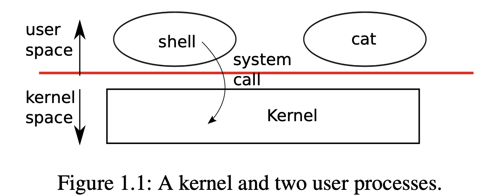
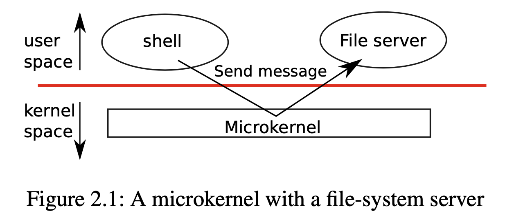

# Operating System Organization

> 参考  [xv6-riscv-book](https://github.com/mit-pdos/xv6-riscv-book) Chapter 2 Operating system organization

Three requirements for OS:

- multiplexing
- isolation
- interaction

## Abstracting physical resources

> Transparency: simplifies interaction

- Abstract the resources into services
- Applications don’t have to be aware of time sharing
- Allows the OS to decide the usage of memory

## User mode, supervisor mode, and system calls



## Kernel organization

| Organization      | Description                                                  | Upside                                                       | Downside                                                     |
| ----------------- | ------------------------------------------------------------ | ------------------------------------------------------------ | ------------------------------------------------------------ |
| monolithic kernel | the entire OS resides in the kernel with full privilege      | convenient, <br />easier for different parts of the OS to cooperate | complex interfaces, <br />easy to make a mistake, <br />a mistake is fatal |
| microkernel       | minimize the code that runs in supervisor mode, <br />execute the bulk of the OS in user mode | reduce the risk of mistakes in the kernel                    |                                                              |



(NOTE> OS services running as processes are called servers)

## Xv6 organization

Xv6 kernel source files:

| File | Description |
| -- | -- |
| bio.c | Disk block cache for the file system. |
| console.c | Connect to the user keyboard and screen. |
| entry.S | Very first boot instructions. |
| exec.c | exec() system call. |
| file.c | File descriptor support. |
| fs.c | File system. |
| kalloc.c | Physical page allocator. |
| kernelvec.S | Handle traps from kernel, and timer interrupts. log.c File system logging and crash recovery. |
| main.c | Control initialization of other modules during boot. pipe.c Pipes. |
| plic.c | RISC-V interrupt controller. |
| printf.c | Formatted output to the console. |
| proc.c | Processes and scheduling. |
| sleeplock.c | Locks that yield the CPU. |
| spinlock.c | Locks that don’t yield the CPU. |
| start.c | Early machine-mode boot code. |
| string.c | C string and byte-array library. |
| swtch.S | Thread switching. |
| syscall.c | Dispatch system calls to handling function. |
| sysfile.c | File-related system calls. |
| sysproc.c | Process-related system calls. |
| trampoline.S | Assembly code to switch between user and kernel. trap.c C code to handle and return from traps and interrupts. uart.c Serial-port console device driver. |
| virtio_disk.c | Disk device driver. |
| vm.c | Manage page tables and address spaces. |

(From: `pbpaste | awk '{ printf("| %s |", $1); for (i=2; i<=NF; i++) printf(" %s", $i); printf(" |\n"); }' | pbcopy`)

The inter-module interfaces are defined in [kernel/defs.h](https://github.com/mit-pdos/xv6-riscv/blob/riscv//kernel/defs.h).

## Process overview

### Process

The unit of isolation: a *process*: an illusion to a program that it has its own private machine (private memory, CPU, file descriptors, etc.). Process is defined as `struct proc` ([kernel/proc.h:86](https://github.com/mit-pdos/xv6-riscv/blob/riscv//kernel/proc.h#L86)).

- `p->state`: whether the process is allocated, ready to run, running, waiting for I/O, or exiting:

```
enum procstate { UNUSED, USED, SLEEPING, RUNNABLE, RUNNING, ZOMBIE };
```

- `p->pagetable`: holds the process’s page table.

### Thread

*Thread* (of execution): executes the process’s instructions.

A thread can be suspended and later resumed.

Threads can “block” in the kernel to wait for I/O, and resume where it left off when the I/O has finished.

### Virtual address

Virtual address: Isolation of memory:  `virtual address -- page tables --> physical address`: 

```
MAXVA
↑    trampoline
|    trapframe
|    Heap
|    Stack (user stack)
|    Global Variables (text and data)
|    Instructions
0
```

- VA is starting at zero
- MAXVA (the maximum virtual address) defined in [ kernel/riscv.h:348](https://github.com/mit-pdos/xv6-riscv/blob/riscv//kernel/riscv.h#L348): Xv6 uses 38 bits to look up virtual addresses in page tables: $\textrm{MAXVA}=2^{38}-1=\textrm{0x3fffffffff}$ 
- Each process has two stacks: user stack & kernel stack (`p->kstack`, for a system call or interrupt, separate and protected from user code).

### System call

`ecall`: a RISC-V instruction to make a system call: 

1. raises hardware privilege level
2. change PC to a kernel-defined entry point, switches to a kernel stack
3. executes the kernel instructions
4. (system call completes) switches back to the user stack
5. returns to user space by calling the `sret` instruction (lowers the hardware privilege level)
6. resumes executing user instructions just after the system call instruction

## Starting xv6 and the first process

1. RISC-V computer powers on, self initializes
2. runs a boot loader (stored in ROM): loads the xv6 kernel into memory at physical address 0x80000000 (range 0x0:0x80000000 contains I/O devices)
3. (in machine mode) executes xv6 starting at `_entry` ([kernel/entry.S:6](https://github.com/mit-pdos/xv6-riscv/blob/riscv//kernel/entry.S#L6)), sets up a stack (`stack0`) for C code (`sp = stack0 + (hartid * 4096)`)
4. `_entry` calls into C code: function  `start` ([kernel/start.c:11](https://github.com/mit-pdos/xv6-riscv/blob/riscv//kernel/start.c#L11))
5. `start`  performs configuration(page-table, interrupts...)
6. switches to supervisor mode, PC change to `main` ([kernel/main.c:11](https://github.com/mit-pdos/xv6-riscv/blob/riscv//kernel/main.c#L11))
7. `main` initializes several devices and subsystems
8. creates the first process by calling userinit ([kernel/proc.c:212](https://github.com/mit-pdos/xv6-riscv/blob/riscv//kernel/proc.c#L212))
9. run `initcode.S` ([user/initcode.S:1](https://github.com/mit-pdos/xv6-riscv/blob/riscv//user/initcode.S#L1)), do `exec("/init")`
10. `init`  ([user/init.c:15](https://github.com/mit-pdos/xv6-riscv/blob/riscv//user/init.c#L15)) creates a console device file, opens it as file descriptors 0, 1, and 2
11. starts a shell on the console
12. The system is up.

---

EOF

---


```c
// By CDFMLR 2021-02-27
printf("See you.\n");
```

顶部图片来自于[小歪API](https://api.ixiaowai.cn)，系随机选取的图片，仅用于检测屏幕显示的机械、光电性能，与文章的任何内容及观点无关，也并不代表本人局部或全部同意、支持或者反对其中的任何内容及观点。如有侵权，联系删除。


